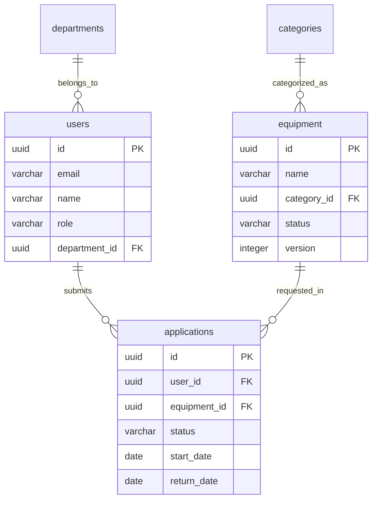

# Buổi 2 — Thiết kế DB (Phần 1): ER図 & Mô hình hóa dữ liệu

---

## Slide 1: Mục tiêu buổi học

### Sau buổi này bạn sẽ biết
- Quy trình tư duy từ nghiệp vụ → Entity → ER図
- Xác định đúng quan hệ: 1:1, 1:N, N:M
- Xử lý các pattern phổ biến: Soft Delete, Status History, Audit Log
- Vẽ ER図 đạt chuẩn tài liệu Nhật Bản

### Ôn tập buổi 1
> **Quiz:** Trong Basic Design, tại sao DB phải được thiết kế TRƯỚC màn hình và API?

---

## Slide 2: Tại sao DB Design quan trọng nhất?

### DB Design là nền móng

```
          DB設計
             │
    ┌────────┼────────┐
    │        │        │
  画面設計  API設計   バッチ設計
    │        │        │
    └────────┼────────┘
             │
          Source Code
```

> Sửa DB sau khi đã viết API = **Rất tốn kém**
> Sửa DB sau khi đã có data = **Có thể gây mất dữ liệu**

### Hệ quả của DB Design sai
- Thiếu foreign key → data inconsistency
- Thiếu index → query chậm, không thể fix không downtime
- Thiếu field quan trọng → migration khó khăn
- Normalization sai → duplicate data, update anomaly

---

## Slide 3: Quy trình thiết kế DB — 5 bước

```
Bước 1: Liệt kê tất cả Entity từ Yokenteigi
         ↓
Bước 2: Xác định Attribute của từng Entity
         ↓
Bước 3: Xác định Relationship (quan hệ)
         ↓
Bước 4: Vẽ ER図 (sơ bộ)
         ↓
Bước 5: Chuẩn hóa (Normalization) + Review
```

---

## Slide 4: Bước 1 — Liệt kê Entity từ Yokenteigi

### Cách đọc Yokenteigi để tìm Entity

**Rule of thumb:** Danh từ quan trọng trong 業務フロー = Entity ứng viên

**Đọc lại Yokenteigi hệ thống thiết bị:**

| Danh từ xuất hiện | Entity? | Lý do |
|------------------|---------|-------|
| ユーザー (社員) | ✅ | Người dùng hệ thống |
| 機器 | ✅ | Đối tượng trung tâm |
| カテゴリ | ✅ | Phân loại thiết bị |
| 申請 (貸出申請) | ✅ | Sự kiện nghiệp vụ chính |
| 通知 | ✅ | Cần lưu lịch sử gửi |
| 監査ログ | ✅ | Yêu cầu bảo mật |
| 部署 (Department) | ✅ | Phân quyền theo phòng ban |
| メール本文 | ❌ | Template, không phải entity |
| パスワード | ❌ | Attribute của User, không phải entity |
| ステータス | ❌ | Attribute hoặc Enum, không phải entity riêng |

### Danh sách Entity cuối cùng
1. `users` — Tài khoản nhân viên
2. `departments` — Phòng ban
3. `categories` — Danh mục thiết bị
4. `equipment` — Thiết bị
5. `equipment_images` — Ảnh thiết bị
6. `applications` — Đơn mượn thiết bị
7. `notifications` — Lịch sử thông báo
8. `audit_logs` — Nhật ký thao tác

---

## Slide 5: Bước 2 — Xác định Attribute

### users

| Column | Type | Nullable | Ghi chú |
|--------|------|---------|--------|
| id | UUID | NOT NULL | PK |
| email | VARCHAR(254) | NOT NULL | UNIQUE |
| name | VARCHAR(100) | NOT NULL | Họ và tên |
| password_hash | VARCHAR(255) | NOT NULL | bcrypt |
| role | ENUM | NOT NULL | `user`, `admin` |
| department_id | UUID | NULL | FK → departments |
| is_active | BOOLEAN | NOT NULL | Default: true |
| created_at | TIMESTAMPTZ | NOT NULL | |
| updated_at | TIMESTAMPTZ | NOT NULL | |
| last_login_at | TIMESTAMPTZ | NULL | |

### departments

| Column | Type | Nullable | Ghi chú |
|--------|------|---------|--------|
| id | UUID | NOT NULL | PK |
| name | VARCHAR(100) | NOT NULL | Tên phòng ban |
| created_at | TIMESTAMPTZ | NOT NULL | |

### Quy tắc chọn kiểu dữ liệu

| Loại dữ liệu | Kiểu nên dùng | Không nên dùng |
|-------------|--------------|--------------|
| ID | UUID | AUTO INCREMENT INT (phân tán) |
| Tên | VARCHAR(100) | TEXT (index khó) |
| Email | VARCHAR(254) | TEXT |
| Timestamp | TIMESTAMPTZ | TIMESTAMP (thiếu timezone) |
| Trạng thái | ENUM hoặc VARCHAR | INT (không đọc được) |
| Tiền | NUMERIC(15,2) | FLOAT (lỗi làm tròn) |
| Flag | BOOLEAN | TINYINT(1) |

---

## Slide 6: Bước 3 — Xác định Relationship

### Quan hệ giữa các Entity

```
departments ──< users
  1              N
  (1 phòng ban có nhiều nhân viên)

users ──< applications
  1         N
  (1 nhân viên có nhiều đơn mượn)

equipment ──< applications
  1              N
  (1 thiết bị có nhiều đơn mượn theo thời gian)

categories ──< equipment
  1               N
  (1 danh mục có nhiều thiết bị)

equipment ──< equipment_images
  1               N
  (1 thiết bị có nhiều ảnh)

applications ──< notifications
  1                  N
  (1 đơn có nhiều notification)
```

### Ký hiệu Crow's Foot (chuẩn Nhật)

```
──|   Exactly one (1)
──<   Many (N)
──|<  One or many (1..N)
──o<  Zero or many (0..N)
──||  Exactly one, mandatory
──o|  Zero or one (0..1)
```

---

## Slide 7: ER図 hoàn chỉnh — Hệ thống thiết bị

```
┌──────────────┐         ┌──────────────────┐
│  departments │         │      users        │
├──────────────┤         ├──────────────────┤
│ id (PK)      │──|──o<──│ id (PK)          │
│ name         │         │ email (UNIQUE)    │
│ created_at   │         │ name             │
└──────────────┘         │ password_hash    │
                         │ role             │
                         │ department_id(FK)│
                         │ is_active        │
                         │ created_at       │
                         │ updated_at       │
                         │ last_login_at    │
                         └────────┬─────────┘
                                  │ 1
                                  │
                                  o< N
                         ┌────────▼─────────┐
┌──────────────┐         │   applications   │
│  categories  │         ├──────────────────┤
├──────────────┤         │ id (PK)          │
│ id (PK)      │         │ user_id (FK)     │
│ name         │         │ equipment_id(FK) │──o<──┐
│ max_days     │         │ status           │      │
│ max_per_user │         │ start_date       │      │
│ created_at   │         │ return_date      │      │
└──────┬───────┘         │ actual_return_at │      │
       │ 1               │ purpose          │      │
       │                 │ reject_reason    │      │
       o< N              │ version (OCC)    │      │
┌──────▼───────┐         │ created_at       │      │
│  equipment   │         │ updated_at       │      │
├──────────────┤         └──────────────────┘      │
│ id (PK)      │──|──o<──────────────────────────── │
│ name         │    N    ┌──────────────────┐
│ category_id(FK)        │  notifications   │
│ status       │         ├──────────────────┤
│ serial_no    │         │ id (PK)          │
│ purchase_date│         │ application_id(FK│
│ notes        │         │ type             │
│ deleted_at   │         │ sent_to          │
│ created_at   │         │ sent_at          │
│ updated_at   │         │ status           │
└──────┬───────┘         └──────────────────┘
       │ 1
       o< N
┌──────▼──────────┐      ┌──────────────────┐
│ equipment_images│      │   audit_logs     │
├─────────────────┤      ├──────────────────┤
│ id (PK)         │      │ id (PK)          │
│ equipment_id(FK)│      │ user_id (FK)     │
│ url             │      │ action           │
│ is_primary      │      │ target_type      │
│ created_at      │      │ target_id        │
└─────────────────┘      │ old_value (JSON) │
                         │ new_value (JSON) │
                         │ ip_address       │
                         │ created_at       │
                         └──────────────────┘
```

---

## Slide 8: Pattern quan trọng — Soft Delete

### Tại sao cần Soft Delete?

**Tình huống:** Admin xóa thiết bị PC-001 khỏi danh sách.
- Nếu Hard Delete: Tất cả `applications` tham chiếu PC-001 sẽ mất FK
- Báo cáo lịch sử sẽ thiếu dữ liệu

### Cách implement

```sql
-- Không xóa vĩnh viễn, chỉ đánh dấu
ALTER TABLE equipment ADD COLUMN deleted_at TIMESTAMPTZ;

-- Query dữ liệu active
SELECT * FROM equipment WHERE deleted_at IS NULL;

-- Xóa (thực ra là cập nhật)
UPDATE equipment SET deleted_at = NOW() WHERE id = 'xxx';
```

### Quy tắc Soft Delete trong thiết kế

| Table | Soft Delete? | Lý do |
|-------|-------------|-------|
| users | ✅ `deleted_at` | Lịch sử mượn phải còn |
| equipment | ✅ `deleted_at` | Lịch sử mượn phải còn |
| applications | ❌ Không xóa | Tài liệu kinh doanh, giữ vĩnh viễn |
| categories | ✅ `deleted_at` | Thiết bị cũ vẫn tham chiếu |
| departments | ✅ `deleted_at` | User cũ vẫn tham chiếu |
| audit_logs | ❌ Không xóa | Bằng chứng bảo mật |
| notifications | ❌ Tự động xóa sau 1 năm | Không cần giữ lâu |

---

## Slide 9: Pattern quan trọng — Status History

### Vấn đề: Chỉ lưu trạng thái hiện tại là không đủ

**Tình huống:** Thiết bị PC-001 hiện tại là `AVAILABLE`.
- Làm sao biết lý do nó từng là `MAINTENANCE`?
- Ai thay đổi trạng thái, khi nào?

### Giải pháp: `equipment_status_histories` table

```sql
CREATE TABLE equipment_status_histories (
  id           UUID PRIMARY KEY DEFAULT gen_random_uuid(),
  equipment_id UUID NOT NULL REFERENCES equipment(id),
  from_status  VARCHAR(20),          -- Trạng thái trước
  to_status    VARCHAR(20) NOT NULL, -- Trạng thái sau
  changed_by   UUID REFERENCES users(id),
  reason       TEXT,                 -- Lý do thay đổi
  created_at   TIMESTAMPTZ NOT NULL DEFAULT NOW()
);
```

### Khi nào cần Status History?

| Entity | Cần Status History? | Lý do |
|--------|-------------------|-------|
| equipment | ✅ Có | Audit, tracking thiệt hại |
| applications | ✅ Có | Quy trình phê duyệt |
| users | ❌ Không | Chỉ cần `is_active` |

---

## Slide 10: Pattern quan trọng — Optimistic Concurrency Control

### Vấn đề Race Condition

```
User A: Xem thiết bị PC-001 → "Available"
User B: Xem thiết bị PC-001 → "Available"
User A: Đặt mượn → Thành công, status = "Reserved"
User B: Đặt mượn → ??? Phải bị lỗi!
```

### Giải pháp: `version` column

```sql
-- Thêm version column vào applications
ALTER TABLE equipment ADD COLUMN version INT NOT NULL DEFAULT 0;

-- Khi đặt mượn: check version
UPDATE equipment
SET status = 'RESERVED', version = version + 1
WHERE id = 'pc-001'
  AND status = 'AVAILABLE'
  AND version = 3;  -- version user đang xem

-- Nếu 0 rows updated → conflict! Báo lỗi cho user
```

### Phản ánh trong Basic Design

```
Bảng equipment: thêm column `version INTEGER NOT NULL DEFAULT 0`

Rule: Khi update status, query phải kèm điều kiện version.
      Nếu affected rows = 0 → trả về lỗi ERR-EQUIP-409
```

---

## Slide 11: Thực hành — Vẽ ER図 tại lớp (30 phút)

### Bài tập

**Đề bài:** Thêm tính năng **メンテナンス記録** (Maintenance Records) vào hệ thống.

**Yêu cầu từ khách hàng:**
- Khi thiết bị bị hỏng hoặc bảo trì, Admin ghi nhận:
  - Mô tả vấn đề
  - Ngày gửi đi sửa, ngày nhận về
  - Chi phí sửa chữa
  - Đơn vị sửa chữa (tên công ty)
- Có thể xem lịch sử bảo trì của từng thiết bị

**Nhiệm vụ:**
1. Xác định Entity mới cần thêm
2. Xác định Attribute của Entity đó
3. Xác định Relationship với các Entity có sẵn
4. Vẽ bổ sung vào ER図

**Thảo luận:** Có cần Status History cho maintenance không?

---

## Slide 11b: AI活用 — ER図を自動生成する (dbdiagram.io + Claude)

### なぜAIを使うか?
> ER図を手書きすると時間がかかる。
> DBテーブル定義を渡すだけでAIがDBML/Mermaidコードを生成 → ツールで即レンダリング

---

### Tool: dbdiagram.io (ER図に最適)

**手順:**

```
Step 1: Claude に以下のプロンプトを送る
Step 2: 生成された DBML コードをコピー
Step 3: dbdiagram.io を開いて左ペインに貼り付ける
Step 4: ER図が自動描画される → Export PNG/PDF
```

---

### プロンプトテンプレート — テーブル定義 → DBML変換

```
以下のテーブル定義をdbdiagram.io のDBML形式に変換してください。
リレーションシップ（references）も含めてください。

テーブル1: users
- id UUID PK
- email VARCHAR(254) NOT NULL UNIQUE
- name VARCHAR(100) NOT NULL
- role VARCHAR(20) NOT NULL (user/admin)
- department_id UUID FK → departments.id
- is_active BOOLEAN NOT NULL DEFAULT true
- created_at TIMESTAMPTZ NOT NULL
- deleted_at TIMESTAMPTZ

テーブル2: equipment
- id UUID PK
- name VARCHAR(200) NOT NULL
- category_id UUID FK → categories.id
- status VARCHAR(20) NOT NULL
- serial_no VARCHAR(100)
- version INTEGER NOT NULL DEFAULT 0
- created_at TIMESTAMPTZ NOT NULL
- deleted_at TIMESTAMPTZ

テーブル3: applications
- id UUID PK
- user_id UUID FK → users.id
- equipment_id UUID FK → equipment.id
- status VARCHAR(20) NOT NULL
- start_date DATE NOT NULL
- return_date DATE NOT NULL
- purpose VARCHAR(500) NOT NULL
- created_at TIMESTAMPTZ NOT NULL
```

---

### AIが生成するDBMLの例

```dbml
Table users {
  id uuid [pk, default: `gen_random_uuid()`]
  email varchar(254) [not null, unique]
  name varchar(100) [not null]
  role varchar(20) [not null, default: 'user', note: 'user | admin']
  department_id uuid [ref: > departments.id]
  is_active boolean [not null, default: true]
  created_at timestamptz [not null]
  deleted_at timestamptz

  indexes {
    email [unique, name: 'idx_users_email']
  }
}

Table equipment {
  id uuid [pk, default: `gen_random_uuid()`]
  name varchar(200) [not null]
  category_id uuid [not null, ref: > categories.id]
  status varchar(20) [not null, default: 'AVAILABLE']
  serial_no varchar(100)
  version integer [not null, default: 0]
  created_at timestamptz [not null]
  deleted_at timestamptz
}

Table applications {
  id uuid [pk, default: `gen_random_uuid()`]
  user_id uuid [not null, ref: > users.id]
  equipment_id uuid [not null, ref: > equipment.id]
  status varchar(20) [not null, default: 'PENDING']
  start_date date [not null]
  return_date date [not null]
  purpose varchar(500) [not null]
  created_at timestamptz [not null]
}
```

> → dbdiagram.io に貼ると矢印付きER図が即座に描画される ✨

---

### プロンプトテンプレート — Mermaid ER図生成

```
以下のテーブル（users, equipment, applications, categories）の
ER図をMermaid erDiagram形式で書いてください。
カーディナリティ（1対多など）も含めてください。
```

**AIが生成するMermaid:**



> → VS Code の「Markdown Preview Mermaid Support」拡張機能でリアルタイムプレビュー可能

---

### AIへのコツ — より良いER図を生成させるには

| ポイント | 良い例 | 悪い例 |
|---------|--------|--------|
| テーブル数 | 3〜5テーブルずつ分割して依頼 | 10テーブル一度に送る |
| 関係の説明 | "users は多数の applications を持つ" | 説明なし |
| 出力形式指定 | "DBML形式で出力してください" | フォーマット指定なし |
| 用途説明 | "dbdiagram.io に貼り付けます" | ツール不明 |
| 要求の明確化 | "インデックスとNOT NULL制約も含めて" | 曖昧なまま |

---

## Slide 12: Tóm tắt buổi 2 & Bài tập về nhà

### Tóm tắt
- Entity = Danh từ quan trọng trong nghiệp vụ
- Xác định đúng quan hệ 1:1 / 1:N / N:M trước khi vẽ
- 3 pattern bắt buộc: Soft Delete, Status History, Optimistic Locking
- UUID cho PK, TIMESTAMPTZ cho timestamp, NUMERIC cho tiền

### Bài tập về nhà
> Hoàn thiện ER図 đầy đủ bao gồm:
> 1. Bảng `equipment_status_histories` với đầy đủ column
> 2. Bảng `application_status_histories` (thêm mới)
> 3. Bảng `maintenance_records` (từ bài tập tại lớp)
> 4. Vẽ lại toàn bộ ER図 với Crow's Foot notation
>
> Tool gợi ý: **dbdiagram.io** (miễn phí, export đẹp)

### Buổi sau
**Buổi 3:** Thiết kế DB (Phần 2) — テーブル定義書 chi tiết từng bảng
