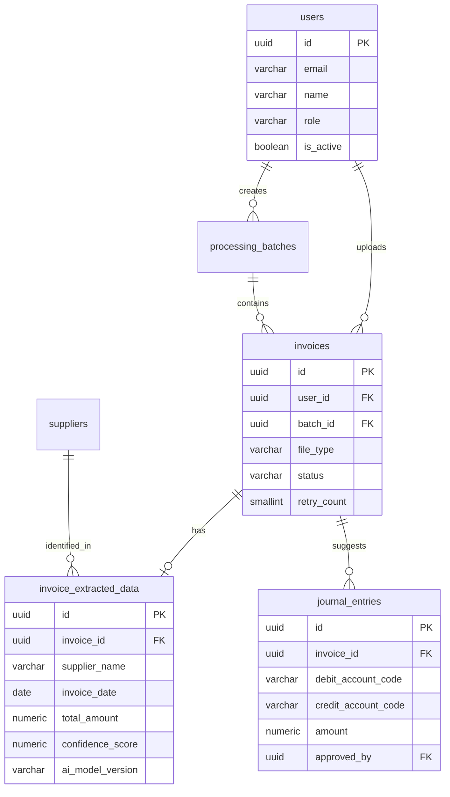

# Buổi 2 — Thiết kế DB (Phần 1): ER図 & Mô hình hóa dữ liệu

---

## Slide 1: Mục tiêu buổi học

### Sau buổi này bạn sẽ biết
- Quy trình tư duy từ nghiệp vụ → Entity → ER図
- Xác định đúng quan hệ: 1:1, 1:N, N:M
- Xử lý các pattern phổ biến: Soft Delete, Status History, Audit Log
- Mô hình hóa State Machine cho AI processing flow
- Vẽ ER図 đạt chuẩn tài liệu Nhật Bản

### Ôn tập buổi 1
> **Quiz:** Trong Basic Design, tại sao DB phải được thiết kế TRƯỚC màn hình và API?

---

## Slide 2: Tại sao DB Design quan trọng nhất?

### DB Design là nền móng

```
          DB設計
             │
    ┌────────┼────────┐
    │        │        │
  画面設計  API設計   バッチ設計
    │        │        │
    └────────┼────────┘
             │
          Source Code
```

> Sửa DB sau khi đã viết API = **Rất tốn kém**
> Sửa DB sau khi đã có data = **Có thể gây mất dữ liệu**

### Hệ quả của DB Design sai
- Thiếu foreign key → data inconsistency
- Thiếu index → query chậm ở 100,000+ hóa đơn, không thể fix không downtime
- Thiếu field `status` → không thể track AI processing state machine
- Normalization sai → duplicate data, update anomaly

---

## Slide 3: Quy trình thiết kế DB — 5 bước

```
Bước 1: Liệt kê tất cả Entity từ Yokenteigi
         ↓
Bước 2: Xác định Attribute của từng Entity
         ↓
Bước 3: Xác định Relationship (quan hệ)
         ↓
Bước 4: Vẽ ER図 (sơ bộ)
         ↓
Bước 5: Chuẩn hóa (Normalization) + Review
```

---

## Slide 4: Bước 1 — Liệt kê Entity từ Yokenteigi

### Cách đọc Yokenteigi để tìm Entity

**Rule of thumb:** Danh từ quan trọng trong 業務フロー = Entity ứng viên

**Đọc lại Yokenteigi hệ thống AI-IA:**

| Danh từ xuất hiện | Entity? | Lý do |
|------------------|---------|-------|
| ユーザー (会計士) | ✅ | Người dùng hệ thống |
| 請求書 (Invoice) | ✅ | Đối tượng trung tâm — file hóa đơn |
| 抽出データ | ✅ | Kết quả AI trích xuất từ hóa đơn |
| 仕訳 (Journal Entry) | ✅ | Sự kiện nghiệp vụ chính — ghi sổ kế toán |
| 仕入先 (Supplier) | ✅ | Master data — nhà cung cấp |
| 勘定科目マッピング | ✅ | Master data — ánh xạ từ khóa → mã tài khoản |
| 処理バッチ | ✅ | Nhóm xử lý nhiều hóa đơn cùng lúc |
| 監査ログ | ✅ | Yêu cầu bảo mật tài chính |
| 通知ログ | ✅ | Cần lưu lịch sử thông báo |
| PDFファイル本体 | ❌ | Lưu trong MinIO, không phải DB entity |
| パスワード | ❌ | Attribute của User, không phải entity |
| ステータス | ❌ | Attribute hoặc Enum, không phải entity riêng |

### Danh sách Entity cuối cùng
1. `users` — Tài khoản kế toán viên
2. `invoices` — Hóa đơn (file metadata + trạng thái xử lý)
3. `invoice_extracted_data` — Dữ liệu AI trích xuất
4. `journal_entries` — Bút toán kế toán được gợi ý/phê duyệt
5. `suppliers` — Nhà cung cấp (master data)
6. `account_code_mapping` — Ánh xạ từ khóa → mã tài khoản
7. `processing_batches` — Nhóm xử lý hàng loạt
8. `audit_logs` — Nhật ký thao tác
9. `notification_logs` — Lịch sử thông báo

---

## Slide 5: Điểm đặc biệt — AI Processing State Machine

### Đây là KEY design point của hệ thống AI-IA

```
                  ┌──────────────┐
                  │   UPLOADED   │  ← File vừa được upload
                  └──────┬───────┘
                         │ Laravel đẩy job vào Redis Queue
                         ▼
                  ┌──────────────┐
                  │    QUEUED    │  ← Đang chờ trong queue
                  └──────┬───────┘
                         │ Worker nhận job
                         ▼
                  ┌──────────────┐
                  │  PROCESSING  │  ← Python AI đang xử lý
                  └──────┬───────┘
                         │
          ┌──────────────┼──────────────┐
          ▼              ▼              ▼
   ┌────────────┐  ┌──────────┐  ┌──────────────┐
   │ COMPLETED  │  │  FAILED  │  │NEEDS_REVIEW  │
   └────────────┘  └──────────┘  └──────────────┘
   AI thành công   Lỗi không    AI thành công nhưng
   & confidence    thể phục hồi confidence_score thấp
   cao             (retry 3x)   → cần người review
```

> **Thiết kế quan trọng:** Cột `status` trong bảng `invoices` phải phản ánh đầy đủ 6 trạng thái này. Flutter polling `GET /invoices/{id}/status` để cập nhật UI.

---

## Slide 6: Bước 2 — Xác định Attribute

### users

| Column | Type | Nullable | Ghi chú |
|--------|------|---------|--------|
| id | UUID | NOT NULL | PK |
| email | VARCHAR(254) | NOT NULL | UNIQUE |
| name | VARCHAR(100) | NOT NULL | Họ và tên |
| password_hash | VARCHAR(255) | NOT NULL | bcrypt |
| role | VARCHAR(20) | NOT NULL | `accountant`, `reviewer`, `admin` |
| department | VARCHAR(100) | NULL | Phòng ban |
| is_active | BOOLEAN | NOT NULL | Default: true |
| created_at | TIMESTAMPTZ | NOT NULL | |
| updated_at | TIMESTAMPTZ | NOT NULL | |
| deleted_at | TIMESTAMPTZ | NULL | Soft delete |

### invoices

| Column | Type | Nullable | Ghi chú |
|--------|------|---------|--------|
| id | UUID | NOT NULL | PK |
| user_id | UUID | NOT NULL | FK → users (người upload) |
| batch_id | UUID | NULL | FK → processing_batches |
| file_path | VARCHAR(500) | NOT NULL | MinIO object key |
| file_type | VARCHAR(10) | NOT NULL | `IMAGE` hoặc `PDF` |
| original_filename | VARCHAR(255) | NOT NULL | Tên file gốc |
| file_size_bytes | INTEGER | NOT NULL | Kích thước file |
| status | VARCHAR(20) | NOT NULL | UPLOADED/QUEUED/PROCESSING/COMPLETED/FAILED/NEEDS_REVIEW |
| retry_count | SMALLINT | NOT NULL | Default 0, max 3 |
| error_message | TEXT | NULL | Lý do lỗi nếu FAILED |
| created_at | TIMESTAMPTZ | NOT NULL | |
| updated_at | TIMESTAMPTZ | NOT NULL | |

### Quy tắc chọn kiểu dữ liệu

| Loại dữ liệu | Kiểu nên dùng | Không nên dùng |
|-------------|--------------|--------------|
| ID | UUID | AUTO INCREMENT INT (phân tán) |
| Tên | VARCHAR(100) | TEXT (index khó) |
| Email | VARCHAR(254) | TEXT |
| Timestamp | TIMESTAMPTZ | TIMESTAMP (thiếu timezone) |
| Trạng thái | VARCHAR(20) + CHECK | INT (không đọc được) |
| Tiền | NUMERIC(15,2) | FLOAT (lỗi làm tròn) |
| Confidence Score AI | NUMERIC(5,4) | FLOAT |
| Flag | BOOLEAN | TINYINT(1) |

---

## Slide 7: Bước 3 — Xác định Relationship

### Quan hệ giữa các Entity

```
users ──< invoices
  1         N
  (1 user upload nhiều hóa đơn)

invoices ──|| invoice_extracted_data
  1               0..1
  (1 hóa đơn có tối đa 1 bộ dữ liệu trích xuất)

invoices ──< journal_entries
  1               N
  (1 hóa đơn có thể có nhiều bút toán gợi ý)

suppliers ──< invoices
  1              N
  (1 nhà cung cấp có nhiều hóa đơn)
  (supplier_id trong invoice_extracted_data)

processing_batches ──< invoices
  1                      N
  (1 batch gồm nhiều hóa đơn)

users ──< processing_batches
  1            N
  (1 user tạo nhiều batch)
```

### Ký hiệu Crow's Foot (chuẩn Nhật)

```
──|   Exactly one (1)
──<   Many (N)
──|<  One or many (1..N)
──o<  Zero or many (0..N)
──||  Exactly one, mandatory
──o|  Zero or one (0..1)
```

---

## Slide 8: ER図 hoàn chỉnh — AI-IA System

```
┌──────────────────┐         ┌──────────────────────┐
│      users       │         │  processing_batches  │
├──────────────────┤         ├──────────────────────┤
│ id (PK)          │──|──o<──│ id (PK)              │
│ email (UNIQUE)   │         │ user_id (FK)         │
│ name             │         │ total_count          │
│ password_hash    │         │ completed_count      │
│ role             │         │ failed_count         │
│ department       │         │ status               │
│ is_active        │         │ created_at           │
│ created_at       │         │ updated_at           │
│ updated_at       │         └──────────┬───────────┘
│ deleted_at       │                    │ 1
└────────┬─────────┘                    │
         │ 1                            o< N
         │                    ┌─────────▼───────────┐
         o< N                 │       invoices       │
         │          ┌─────────┤──────────────────────┤
         │          │         │ id (PK)              │
         └──────────┘         │ user_id (FK)         │
                              │ batch_id (FK) NULL   │
                              │ file_path            │
                              │ file_type            │
                              │ original_filename    │
                              │ status               │
                              │ retry_count          │
                              │ error_message NULL   │
                              │ created_at           │
                              │ updated_at           │
                              └──────┬───────────────┘
                                     │ 1
                        ┌────────────┼───────────────┐
                        │ 0..1       │ 0..N           │
            ┌───────────▼──────┐  ┌──▼───────────────┐
            │invoice_extracted │  │  journal_entries │
            │     _data        │  ├──────────────────┤
            ├──────────────────┤  │ id (PK)          │
            │ id (PK)          │  │ invoice_id (FK)  │
            │ invoice_id (FK)  │  │ debit_account_code│
            │ supplier_name    │  │ credit_account_code│
            │ invoice_date     │  │ amount           │
            │ total_amount     │  │ description      │
            │ tax_amount       │  │ approved_by NULL │
            │ confidence_score │  │ approved_at NULL │
            │ ai_model_version │  │ created_at       │
            │ created_at       │  │ updated_at       │
            └──────────────────┘  └──────────────────┘

┌────────────────────┐      ┌──────────────────────┐
│     suppliers      │      │  account_code_mapping│
├────────────────────┤      ├──────────────────────┤
│ id (PK)            │      │ id (PK)              │
│ name               │      │ keyword              │
│ tax_id (UNIQUE)    │      │ account_code         │
│ default_debit_code │      │ account_name         │
│ default_credit_code│      │ priority             │
│ created_at         │      │ created_at           │
│ updated_at         │      │ updated_at           │
└────────────────────┘      └──────────────────────┘

┌──────────────────┐         ┌──────────────────────┐
│   audit_logs     │         │  notification_logs   │
├──────────────────┤         ├──────────────────────┤
│ id (PK)          │         │ id (PK)              │
│ user_id (FK) NULL│         │ user_id (FK)         │
│ action           │         │ type                 │
│ target_type      │         │ payload (JSONB)      │
│ target_id NULL   │         │ sent_at              │
│ old_value (JSONB)│         │ read_at NULL         │
│ new_value (JSONB)│         │ created_at           │
│ ip_address       │         └──────────────────────┘
│ created_at       │
└──────────────────┘
```

---

## Slide 9: Pattern quan trọng — Soft Delete

### Tại sao cần Soft Delete?

**Tình huống:** Kế toán viên xóa hóa đơn INV-001 khỏi danh sách.
- Nếu Hard Delete: Tất cả `journal_entries` và `invoice_extracted_data` tham chiếu INV-001 sẽ mất FK
- Báo cáo tài chính và audit trail sẽ thiếu dữ liệu — vi phạm quy định kế toán

### Cách implement

```sql
-- Không xóa vĩnh viễn, chỉ đánh dấu
ALTER TABLE invoices ADD COLUMN deleted_at TIMESTAMPTZ;

-- Query dữ liệu active
SELECT * FROM invoices WHERE deleted_at IS NULL;

-- Xóa (thực ra là cập nhật)
UPDATE invoices SET deleted_at = NOW() WHERE id = 'xxx';
```

### Quy tắc Soft Delete trong thiết kế AI-IA

| Table | Soft Delete? | Lý do |
|-------|-------------|-------|
| users | ✅ `deleted_at` | Journal entries phải còn lưu người tạo |
| invoices | ✅ `deleted_at` | Tài liệu tài chính, audit trail |
| journal_entries | ❌ Không xóa | Sổ sách kế toán, giữ vĩnh viễn |
| suppliers | ✅ `deleted_at` | Hóa đơn cũ vẫn tham chiếu |
| invoice_extracted_data | ❌ Không xóa | Cần để audit AI accuracy |
| audit_logs | ❌ Không xóa | Bằng chứng bảo mật, 7 năm |
| notification_logs | ❌ Tự động xóa sau 1 năm | Không cần giữ lâu |

---

## Slide 10: Pattern quan trọng — AI Processing State History

### Vấn đề: Chỉ lưu trạng thái hiện tại là không đủ

**Tình huống:** Hóa đơn INV-001 hiện tại là `FAILED`.
- Làm sao biết nó đã retry bao nhiêu lần?
- Khi nào chuyển từ PROCESSING → FAILED?
- Lỗi cụ thể là gì?

### Giải pháp: Thiết kế đầy đủ trong bảng `invoices`

Khác với equipment system, AI-IA lưu trạng thái chi tiết ngay trong bảng `invoices`:
- `retry_count` — số lần retry
- `error_message` — lỗi cụ thể từ Python AI service
- `status` — trạng thái hiện tại
- `updated_at` — thời điểm thay đổi cuối cùng

Kết hợp với `audit_logs` để có đầy đủ lịch sử:

```sql
-- Xem lịch sử thay đổi status của hóa đơn INV-001
SELECT action, old_value->>'status', new_value->>'status',
       created_at
FROM audit_logs
WHERE target_type = 'invoices'
  AND target_id = 'INV-001-UUID'
ORDER BY created_at;
```

### Khi nào cần bảng Status History riêng?

| Entity | Cần bảng riêng? | Lý do |
|--------|-----------------|-------|
| invoices | Dùng audit_logs | Trạng thái đơn giản, ít bước |
| journal_entries | Dùng audit_logs | Chỉ cần ai approve, khi nào |
| processing_batches | Không cần | Chỉ lưu tổng count |

---

## Slide 11: Pattern quan trọng — Confidence Score & NEEDS_REVIEW

### Thiết kế quan trọng cho AI system

```
AI xử lý hóa đơn → trả về confidence_score (0.0 ~ 1.0)

confidence_score >= 0.85  → status = COMPLETED  (tự động)
confidence_score  < 0.85  → status = NEEDS_REVIEW (cần người kiểm tra)
```

**Phản ánh trong DB:**

```sql
-- invoice_extracted_data
confidence_score  NUMERIC(5,4) NOT NULL  -- Ví dụ: 0.9234
ai_model_version  VARCHAR(50)  NOT NULL  -- Ví dụ: 'layoutlmv3-base-sroie-v1.2'
```

**Phản ánh trong Basic Design:**
```
Rule: Sau khi AI xử lý xong,
      IF confidence_score >= 0.85 THEN status = 'COMPLETED'
      ELSE status = 'NEEDS_REVIEW'
      Laravel Worker thực hiện logic này — KHÔNG phải Python AI Service
```

> **Tại sao quan trọng:** Kế toán viên chỉ cần review hóa đơn có confidence thấp, tiết kiệm thời gian đáng kể.

---

## Slide 12: Thực hành — Vẽ ER図 tại lớp (30 phút)

### Bài tập

**Đề bài:** Thêm tính năng **OCR精度ダッシュボード** (OCR Accuracy Dashboard) vào hệ thống.

**Yêu cầu từ khách hàng:**
- Admin muốn theo dõi độ chính xác của AI theo thời gian
- Cần lưu: ngày, tổng số hóa đơn xử lý, số COMPLETED, số NEEDS_REVIEW, số FAILED, average confidence score
- Có thể xem theo tuần / tháng
- So sánh giữa các phiên bản AI model

**Nhiệm vụ:**
1. Xác định Entity mới cần thêm (bảng thống kê riêng hay query từ bảng hiện có?)
2. Xác định Attribute
3. Xác định Relationship với các Entity có sẵn
4. Vẽ bổ sung vào ER図

**Thảo luận:** Có nên tạo bảng `ai_accuracy_reports` riêng hay query aggregate từ `invoice_extracted_data`?

---

## Slide 12b: AI活用 — ER図を自動生成する (dbdiagram.io + Claude)

### なぜAIを使うか?
> ER図を手書きすると時間がかかる。
> DBテーブル定義を渡すだけでAIがDBML/Mermaidコードを生成 → ツールで即レンダリング

---

### Tool: dbdiagram.io (ER図に最適)

**手順:**

```
Step 1: Claude に以下のプロンプトを送る
Step 2: 生成された DBML コードをコピー
Step 3: dbdiagram.io を開いて左ペインに貼り付ける
Step 4: ER図が自動描画される → Export PNG/PDF
```

---

### プロンプトテンプレート — テーブル定義 → DBML変換

```
以下のテーブル定義をdbdiagram.io のDBML形式に変換してください。
リレーションシップ（references）も含めてください。

システム: AI請求書自動処理システム (AI-IA)

テーブル1: users
- id UUID PK
- email VARCHAR(254) NOT NULL UNIQUE
- name VARCHAR(100) NOT NULL
- role VARCHAR(20) NOT NULL (accountant/reviewer/admin)
- department VARCHAR(100) NULL
- is_active BOOLEAN NOT NULL DEFAULT true
- created_at TIMESTAMPTZ NOT NULL
- deleted_at TIMESTAMPTZ

テーブル2: invoices
- id UUID PK
- user_id UUID FK → users.id
- batch_id UUID FK → processing_batches.id NULL
- file_path VARCHAR(500) NOT NULL
- file_type VARCHAR(10) NOT NULL
- status VARCHAR(20) NOT NULL DEFAULT 'UPLOADED'
- retry_count SMALLINT NOT NULL DEFAULT 0
- error_message TEXT NULL
- created_at TIMESTAMPTZ NOT NULL
- updated_at TIMESTAMPTZ NOT NULL

テーブル3: invoice_extracted_data
- id UUID PK
- invoice_id UUID FK → invoices.id UNIQUE
- supplier_name VARCHAR(255) NULL
- invoice_date DATE NULL
- total_amount NUMERIC(15,2) NULL
- tax_amount NUMERIC(15,2) NULL
- confidence_score NUMERIC(5,4) NOT NULL
- ai_model_version VARCHAR(50) NOT NULL
- created_at TIMESTAMPTZ NOT NULL
```

---

### AIが生成するDBMLの例

```dbml
Table users {
  id uuid [pk, default: `gen_random_uuid()`]
  email varchar(254) [not null, unique]
  name varchar(100) [not null]
  role varchar(20) [not null, default: 'accountant',
    note: 'accountant | reviewer | admin']
  department varchar(100)
  is_active boolean [not null, default: true]
  created_at timestamptz [not null]
  deleted_at timestamptz

  indexes {
    email [unique, name: 'idx_users_email']
  }
}

Table invoices {
  id uuid [pk, default: `gen_random_uuid()`]
  user_id uuid [not null, ref: > users.id]
  batch_id uuid [ref: > processing_batches.id]
  file_path varchar(500) [not null]
  file_type varchar(10) [not null, note: 'IMAGE | PDF']
  status varchar(20) [not null, default: 'UPLOADED',
    note: 'UPLOADED|QUEUED|PROCESSING|COMPLETED|FAILED|NEEDS_REVIEW']
  retry_count smallint [not null, default: 0]
  error_message text
  created_at timestamptz [not null]
  updated_at timestamptz [not null]

  indexes {
    (status, created_at) [name: 'idx_invoices_status_created']
    (user_id, status) [name: 'idx_invoices_user_status']
  }
}

Table invoice_extracted_data {
  id uuid [pk, default: `gen_random_uuid()`]
  invoice_id uuid [not null, unique, ref: - invoices.id]
  supplier_name varchar(255)
  invoice_date date
  total_amount numeric(15,2)
  tax_amount numeric(15,2)
  confidence_score numeric(5,4) [not null]
  ai_model_version varchar(50) [not null]
  created_at timestamptz [not null]
}
```

> → dbdiagram.io に貼ると矢印付きER図が即座に描画される

---

### プロンプトテンプレート — Mermaid ER図生成

```
以下のテーブル（users, invoices, invoice_extracted_data,
journal_entries, suppliers）の
ER図をMermaid erDiagram形式で書いてください。
カーディナリティ（1対多など）も含めてください。
```

**AIが生成するMermaid:**



> → VS Code の「Markdown Preview Mermaid Support」拡張機能でリアルタイムプレビュー可能

---

### AIへのコツ — より良いER図を生成させるには

| ポイント | 良い例 | 悪い例 |
|---------|--------|--------|
| テーブル数 | 3〜5テーブルずつ分割して依頼 | 10テーブル一度に送る |
| 関係の説明 | "invoices は1つの invoice_extracted_data を持つ" | 説明なし |
| 出力形式指定 | "DBML形式で出力してください" | フォーマット指定なし |
| 用途説明 | "dbdiagram.io に貼り付けます" | ツール不明 |
| 要求の明確化 | "インデックスとNOT NULL制約も含めて" | 曖昧なまま |

---

## Slide 13: Tóm tắt buổi 2 & Bài tập về nhà

### Tóm tắt
- Entity = Danh từ quan trọng trong nghiệp vụ
- Xác định đúng quan hệ 1:1 / 1:N / N:M trước khi vẽ
- AI Processing State Machine là thiết kế cốt lõi của AI-IA: UPLOADED → QUEUED → PROCESSING → COMPLETED / FAILED / NEEDS_REVIEW
- Confidence score quyết định trạng thái cuối (COMPLETED vs NEEDS_REVIEW)
- UUID cho PK, TIMESTAMPTZ cho timestamp, NUMERIC cho tiền và confidence score

### Bài tập về nhà
> Hoàn thiện ER図 đầy đủ bao gồm:
> 1. Bảng `account_code_mapping` với đầy đủ column (keyword, account_code, account_name, priority)
> 2. Bảng `notification_logs` với đầy đủ column (type, payload JSONB, sent_at, read_at)
> 3. Bảng `processing_batches` với đầy đủ column
> 4. Vẽ lại toàn bộ ER図 với Crow's Foot notation
>
> Tool gợi ý: **dbdiagram.io** (miễn phí, export đẹp)

### Buổi sau
**Buổi 3:** Thiết kế DB (Phần 2) — テーブル定義書 chi tiết từng bảng
