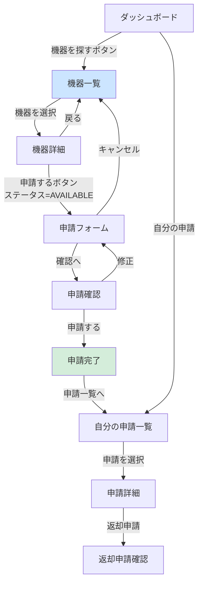

# Buổi 4 — Thiết kế màn hình: Wireframe & 画面仕様書

---

## Slide 1: Mục tiêu buổi học

### Sau buổi này bạn sẽ biết
- Nguyên tắc thiết kế Wireframe trong Basic Design (khác UI Design)
- Viết 画面仕様書 (Screen Specification) đầy đủ cho từng màn hình
- Thiết kế màn hình dựa trên DB đã thiết kế
- Xử lý các case đặc biệt: empty state, loading, error state

### Ôn tập buổi 3
> **Quiz:** Partial Index là gì? Khi nào dùng? Cho ví dụ từ hệ thống thiết bị.

---

## Slide 2: Wireframe trong Basic Design là gì?

### Không phải UI Design — Không phải Mockup

```
Wireframe (Basic Design)        UI Design / Mockup
──────────────────────────────────────────────────
Mục tiêu: Xác định LAYOUT      Mục tiêu: Xác định ĐẸP
Công cụ: draw.io, Balsamiq      Công cụ: Figma, Sketch
Màu sắc: Trắng/xám             Màu sắc: Brand colors
Chi tiết: Component, dữ liệu   Chi tiết: Font, spacing, icon
Đọc bởi: Dev + BA + KH         Đọc bởi: Dev + Designer + KH
Thay đổi: Dễ dàng              Thay đổi: Tốn công
```

### Wireframe trong Basic Design cần thể hiện

- **Layout:** Vị trí các thành phần (header, sidebar, content, footer)
- **Components:** Button, table, form, modal, pagination
- **Data:** Field nào hiển thị, từ đâu lấy
- **State:** Empty, loading, error, success
- **Action:** Nút nào làm gì, dẫn đến đâu

---

## Slide 3: Cấu trúc 画面仕様書 — 1 màn hình

### Template chuẩn cho mỗi màn hình

```
画面ID:    S020
画面名:    機器一覧画面
URL:       /equipment
権限:      全ログインユーザー
呼び出し:  ログイン後のダッシュボードからナビゲーション

【目的】
機器の一覧を表示し、ユーザーが借りたい機器を探せるようにする

【表示項目】
(表参照)

【操作・アクション】
(表参照)

【表示ロジック】
(条件分岐など)

【エラー・例外】
(エラー時の表示)

【Wireframe】
(図参照)

【API】
GET /api/equipment  ← この画面が使用するAPI
```

---

## Slide 4: Wireframe — S020 機器一覧画面

```
┌─────────────────────────────────────────────────────────┐
│  LOGO    ホーム  機器一覧  自分の申請         [山田太郎▼] │  ← Header
├─────────────────────────────────────────────────────────┤
│  機器一覧                                                │
│                                                         │
│  ┌────────────────────────────────────────────────────┐ │
│  │ カテゴリ: [全て▼]  ステータス: [全て▼]  🔍[検索欄  ]│ │  ← Filter
│  └────────────────────────────────────────────────────┘ │
│                                                         │
│  500件中 1〜20件を表示                  [← 前] [次 →]  │  ← Pagination
│                                                         │
│  ┌──────────────────────────────────────────────────┐  │
│  │ 機器名        │ カテゴリ │ ステータス │ 保管場所 │  │  │  ← Table Header
│  ├──────────────────────────────────────────────────┤  │
│  │ MacBook Pro  │  PC     │ ●利用可能  │ 東京3F  │[申請] │  ← Row (Available)
│  ├──────────────────────────────────────────────────┤  │
│  │ ThinkPad X1  │  PC     │ ●貸出中    │ 東京3F  │[詳細] │  ← Row (Borrowed)
│  ├──────────────────────────────────────────────────┤  │
│  │ プロジェクター │ 会議室  │ ●利用可能  │ 大阪2F  │[申請] │
│  ├──────────────────────────────────────────────────┤  │
│  │ 社用車 A     │  車両   │ ●予約済み  │ 地下駐車 │[詳細] │
│  └──────────────────────────────────────────────────┘  │
│                                                         │
│                       [← 前] 1 2 3 ... 25 [次 →]      │
└─────────────────────────────────────────────────────────┘

凡例:
● 利用可能  = 緑
● 貸出中    = 赤
● 予約済み  = 黄
● メンテナンス = グレー
```

---

## Slide 5: 画面仕様書 — S020 詳細定義

### 表示項目

| # | 項目名 | 表示内容 | データソース | 備考 |
|---|--------|---------|------------|------|
| 1 | 機器名 | equipment.name | equipment | クリックで詳細へ |
| 2 | カテゴリ | categories.name | JOIN categories | |
| 3 | ステータス | ステータスラベル+色 | equipment.status | 凡例参照 |
| 4 | 保管場所 | equipment.location | equipment | NULLの場合「未設定」 |
| 5 | 操作ボタン | 申請/詳細 | — | ステータスで分岐 |

### ステータス別ボタン表示ルール

| ステータス | ボタン | アクション |
|----------|--------|----------|
| AVAILABLE | [申請する] (青) | S030 申請フォームへ |
| RESERVED | [詳細を見る] (灰) | S021 詳細へ |
| BORROWED | [詳細を見る] (灰) | S021 詳細へ |
| MAINTENANCE | [メンテナンス中] (無効) | — |
| DISPOSED | 表示しない | — |

### フィルター仕様

| フィルター | 選択肢 | デフォルト | 連動 |
|----------|--------|---------|------|
| カテゴリ | 全て + カテゴリ一覧 | 全て | 画面リロードなし(JS) |
| ステータス | 全て / 利用可能 / 貸出中 / 予約済み / メンテナンス中 | 全て | 同上 |
| 検索 | フリーテキスト | 空 | 機器名・シリアル番号を対象 |

### Pagination仕様

| 項目 | 値 |
|------|-----|
| 1ページ表示件数 | 20件 |
| ページネーション表示 | 現在±2ページ + 最初/最後 |
| URLパラメータ | `?page=1&per=20&category=xxx&status=xxx&q=xxx` |

---

## Slide 6: Wireframe — S021 機器詳細画面

```
┌─────────────────────────────────────────────────────────┐
│  LOGO    ホーム  機器一覧  自分の申請         [山田太郎▼] │
├─────────────────────────────────────────────────────────┤
│  [← 機器一覧に戻る]                                      │
│                                                         │
│  ┌─────────────────┐  ┌────────────────────────────┐   │
│  │                 │  │ MacBook Pro 14" (M3 Pro)   │   │
│  │   [機器写真]    │  │ カテゴリ: PC・ノートPC       │   │
│  │                 │  │ ステータス: ● 利用可能       │   │
│  │                 │  │ 保管場所: 東京オフィス 3F    │   │
│  └─────────────────┘  │ 資産番号: PC-2024-0042      │   │
│                       │ シリアル: C02XL1234ABCD     │   │
│                       │ 購入日: 2024/01/15           │   │
│                       └────────────────────────────┘   │
│                                                         │
│                            ┌──────────────────────┐    │
│                            │   [この機器を申請する]  │   │  ← AVAILABLE時のみ
│                            └──────────────────────┘    │
│                                                         │
│  ─────── 貸出中の場合 ──────────────────────────────    │
│  現在: 田中 花子さんが貸出中 (2026/03/01〜03/31)         │  ← 氏名は管理者のみ
│                                                         │
│  ─────── 備考 ────────────────────────────────────     │
│  [notes の内容]                                          │
│                                                         │
│  ─────── 貸出履歴 (直近5件) ─────────────────────────   │
│  ┌──────────────────────────────────────────────────┐  │
│  │ 期間                │ 利用者   │ ステータス        │  │  ← Admin: 氏名表示
│  │ 2026/01 〜 2026/02 │ (非公開) │ 返却済み          │  │  ← User: 非公開
│  │ 2025/11 〜 2025/12 │ (非公開) │ 返却済み          │  │
│  └──────────────────────────────────────────────────┘  │
└─────────────────────────────────────────────────────────┘
```

---

## Slide 7: Wireframe — S030 貸出申請フォーム

```
┌─────────────────────────────────────────────────────────┐
│  LOGO    ホーム  機器一覧  自分の申請         [山田太郎▼] │
├─────────────────────────────────────────────────────────┤
│  貸出申請                                                │
│  申請機器: MacBook Pro 14" (M3 Pro)                      │
│                                                         │
│  ┌─────────────────────────────────────────────────┐   │
│  │  貸出開始日 *                                    │   │
│  │  [      YYYY/MM/DD      ] 📅                    │   │
│  │                                                 │   │
│  │  返却予定日 *                                    │   │
│  │  [      YYYY/MM/DD      ] 📅                    │   │
│  │  ⚠ このカテゴリの最大貸出期間: 14日             │   │  ← Dynamic hint
│  │                                                 │   │
│  │  利用目的 * (最大500文字)                         │   │
│  │  ┌──────────────────────────────────────────┐  │   │
│  │  │                                          │  │   │
│  │  │                                          │  │   │
│  │  └──────────────────────────────────────────┘  │   │
│  │  残り 500文字                                   │   │  ← Character counter
│  │                                                 │   │
│  │  ⚠ ご注意: 申請後、管理者の承認が必要です         │   │
│  │                                                 │   │
│  │         [キャンセル]  [確認画面へ →]             │   │
│  └─────────────────────────────────────────────────┘  │
└─────────────────────────────────────────────────────────┘

バリデーション (リアルタイム):
・貸出開始日: 本日以降
・返却予定日: 開始日より後、かつカテゴリ最大日数以内
・利用目的: 1文字以上
```

---

## Slide 8: Wireframe — S131 Admin 申請詳細・承認

```
┌──────────────────────────────────────────────────────────┐
│  LOGO   ダッシュ  機器管理  申請管理  アカウント  レポート │  ← Admin Nav
├──────────────────────────────────────────────────────────┤
│  [← 申請一覧に戻る]                申請番号: APP-202603-00042 │
│                                                          │
│  ┌──────────────────────────────────────────────────┐   │
│  │  申請情報                                         │   │
│  ├──────────────────────────────────────────────────┤   │
│  │  申請者:   山田 太郎 (yamada@company.co.jp)       │   │
│  │  部署:     開発部                                │   │
│  │  申請日時: 2026/03/24 09:15:32                   │   │
│  ├──────────────────────────────────────────────────┤   │
│  │  機器:     MacBook Pro 14" (M3 Pro)              │   │
│  │  資産番号: PC-2024-0042                          │   │
│  │  現在の場所: 東京オフィス 3F                      │   │
│  ├──────────────────────────────────────────────────┤   │
│  │  貸出期間: 2026/04/01 〜 2026/04/14 (14日間)     │   │
│  │  利用目的: 出張先でのシステム開発作業のため        │   │
│  └──────────────────────────────────────────────────┘   │
│                                                          │
│  ── ステータス: 申請中 ────────────────────────────────   │
│                                                          │
│  ┌──────────────────────┐  ┌──────────────────────────┐  │
│  │  [✓ 承認する]        │  │  却下理由 (必須):         │  │
│  │  (承認ボタン)        │  │  [                      ]│  │
│  └──────────────────────┘  │  [✗ 却下する]            │  │
│                            └──────────────────────────┘  │
└──────────────────────────────────────────────────────────┘
```

---

## Slide 9: Empty State / Loading / Error State の設計

### 各Stateの設計も画面仕様書に含める

**Empty State — 機器一覧 (0件の場合)**
```
┌──────────────────────────────────┐
│                                  │
│        🔍                        │
│  該当する機器が見つかりません     │
│                                  │
│  [フィルターをリセットする]       │
│                                  │
└──────────────────────────────────┘
```

**Loading State**
```
┌──────────────────────────────────┐
│  ████████████████                │  ← Skeleton UI
│  ████████  ████  ████████       │
│  ████████████████                │
└──────────────────────────────────┘
```

**Error State — API失敗**
```
┌──────────────────────────────────┐
│  ⚠ データの読み込みに失敗しました │
│  [再読み込みする]                 │
└──────────────────────────────────┘
```

**画面仕様書への記載:**
```
【状態別表示】
・通常: テーブル表示（20件/ページ）
・0件: Empty State (図3参照)
・ローディング中: Skeleton UI (図4参照)
・API失敗: エラーバナー + 再試行ボタン
```

---

## Slide 10: 画面仕様書 全体マップ

### 全18画面の対応表

| 画面ID | 画面名 | 担当API | 備考 |
|--------|--------|--------|------|
| S001 | ログイン | POST /auth/login | |
| S002 | PW変更 | PUT /auth/password | |
| S010 | ダッシュボード(User) | GET /dashboard | |
| S011 | ダッシュボード(Admin) | GET /admin/dashboard | |
| S020 | 機器一覧 | GET /equipment | Filter/Pagination |
| S021 | 機器詳細 | GET /equipment/{id} | |
| S030 | 申請フォーム | — | Client-side form |
| S031 | 申請確認 | — | Client-side confirm |
| S032 | 申請完了 | POST /applications | |
| S040 | 自分の申請一覧 | GET /my/applications | |
| S041 | 申請詳細(User) | GET /my/applications/{id} | |
| S042 | 返却申請確認 | PUT /applications/{id}/return | |
| S100 | 機器管理一覧 | GET /admin/equipment | Admin |
| S101 | 機器登録/編集 | POST/PUT /admin/equipment | Admin |
| S102 | CSV一括インポート | POST /admin/equipment/import | Admin |
| S110 | 申請管理一覧 | GET /admin/applications | Admin |
| S111 | 申請詳細・承認 | GET/PUT /admin/applications/{id} | Admin |
| S120 | アカウント管理 | GET/POST/PUT /admin/users | Admin |
| S130 | レポート | GET /admin/reports | Admin |

---

## Slide 11: 画面設計のチェックリスト

### 画面仕様書提出前の確認

**データ面**
- [ ] 全表示項目のデータソース（テーブル.カラム）が明記されている
- [ ] NULL値の場合の表示が定義されている（例: 「未設定」）
- [ ] ソート順が定義されている

**ロジック面**
- [ ] 権限によって表示/非表示が切り替わる部分が定義されている
- [ ] ステータス別のボタン表示ルールが定義されている
- [ ] バリデーションエラーの表示箇所が定義されている

**State面**
- [ ] Empty State のデザインが定義されている
- [ ] ローディング状態が定義されている
- [ ] APIエラー時の表示が定義されている

**操作面**
- [ ] 全ボタン・リンクのアクションが定義されている
- [ ] 遷移先画面IDが明記されている
- [ ] 確認ダイアログが必要な操作が定義されている

---

## Slide 12: Thực hành tại lớp (30 phút)

### Bài tập — Vẽ Wireframe cho Admin Dashboard (S011)

**Yêu cầu:**
Dashboard Admin cần hiển thị:
- Số đơn đang chờ phê duyệt (PENDING) → Click dẫn đến S110
- Số thiết bị đang quá hạn → Click dẫn đến S110 (filter: overdue)
- Số thiết bị đang bảo trì
- Danh sách 5 đơn mới nhất cần xử lý
- Biểu đồ: số đơn theo tuần (7 ngày gần nhất)

**Nhiệm vụ:**
1. Vẽ Wireframe bằng draw.io hoặc vẽ tay (ASCII art cũng được)
2. Liệt kê Data Source cho từng widget
3. Xác định API cần thiết để lấy dữ liệu

---

## Slide 12b: AI活用 — Wireframe & 画面遷移図を自動生成する

### ツール別用途マップ

| ツール | 得意な図 | 特徴 | 料金 |
|--------|---------|------|------|
| **v0.dev** (Vercel) | Wireframe → 実コード | React/HTML生成、クリック可能 | 無料(制限あり) |
| **Whimsical AI** | Wireframe, Flowchart | 自然言語から即生成、シンプル | 無料(制限あり) |
| **Claude + Mermaid** | 画面遷移図, Flowchart | テキストで正確に制御可能 | Claude利用料のみ |
| **Eraser.io** | Architecture, Flowchart | AI prompt → 図生成 | 無料(free tier) |

---

### Tool 1: v0.dev — Wireframeをコード付きで生成

**手順:**
```
1. v0.dev (https://v0.dev) を開く
2. プロンプトを入力
3. 生成されたコンポーネントをプレビュー
4. スクリーンショットを設計書に貼り付け
```

**プロンプトテンプレート — 機器一覧画面:**
```
社内機器管理システムの機器一覧画面を作成してください。

要件:
- ヘッダー: ロゴ、ナビ(ホーム/機器一覧/自分の申請)、ユーザー名
- フィルター: カテゴリドロップダウン、ステータスドロップダウン、検索ボックス
- テーブル: 機器名、カテゴリ、ステータス(バッジ)、保管場所、操作ボタン
- ステータス色: 利用可能=緑、貸出中=赤、予約済み=黄、メンテナンス=グレー
- 操作ボタン: 利用可能→「申請する」(青)、それ以外→「詳細を見る」(灰)
- ページネーション: 下部に1ページ20件

TailwindCSS + shadcn/ui を使用してください。
```

---

### Tool 2: Claude + Mermaid — 画面遷移図を生成

**プロンプトテンプレート:**
```
社内機器管理・貸出システムの画面遷移図を
Mermaid flowchart形式で書いてください。

対象フロー: ユーザーの貸出申請フロー
画面:
- S010: ダッシュボード
- S020: 機器一覧
- S021: 機器詳細
- S030: 申請フォーム
- S031: 申請確認
- S032: 申請完了
- S040: 自分の申請一覧

遷移条件も矢印のラベルに記載してください。
```

**AIが生成するMermaid:**



---

### Tool 3: Whimsical AI — 自然言語からFlowchart

**手順:**
```
1. whimsical.com を開く → New → Flowchart
2. 右上の「AI」ボタンをクリック
3. 日本語または英語でフロー説明を入力
4. 自動生成されたFlowchartを編集
```

**プロンプト例:**
```
Admin が貸出申請を審査するワークフローを
フローチャートで描いてください:
申請一覧確認 → 申請詳細を開く → 承認/却下を選択 →
承認: 機器ステータスをBORROWEDに更新 → メール送信
却下: 却下理由を入力 → メール送信
```

---

### Tool 4: Claude + ASCII → draw.io XML変換

**プロンプトテンプレート:**
```
以下のASCIIワイヤーフレームをdraw.io (diagrams.net)の
XML形式に変換してください。

[ここにASCIIワイヤーフレームを貼り付け]

出力: draw.io のXMLコード（<mxGraphModel>から始まる形式）
```

> → 生成されたXMLを draw.io で「Extras > Edit Diagram」から貼り付けると図が完成

---

### AI活用のベストプラクティス

```
✅ 効果的な使い方:
  1. ドラフト生成にAIを使う（完成品ではなくたたき台）
  2. 生成されたものを必ず人間がレビュー・修正する
  3. プロンプトに「システムの背景情報」を毎回含める
  4. 「〇〇形式で出力」と出力フォーマットを指定する

❌ 注意点:
  - AIが生成した図をそのまま提出しない
  - 機密情報（本番URLや認証情報）をプロンプトに含めない
  - 生成結果のビジネスロジックが正しいかは人間が確認する
```

---

## Slide 13: Tóm tắt buổi 4 & Bài tập về nhà

### Tóm tắt
- Wireframe trong Basic Design = Layout + Data + State + Action
- Mỗi màn hình cần định nghĩa: Empty / Loading / Error State
- Tất cả cột hiển thị phải có Data Source (table.column)
- Phân quyền hiển thị phải được ghi rõ trong từng màn hình

### Bài tập về nhà
> Viết 画面仕様書 đầy đủ (Wireframe + Spec Table) cho 3 màn hình:
>
> 1. **S040 — 自分の申請一覧** (User xem lịch sử đơn mượn của mình)
> 2. **S100 — 機器管理一覧** (Admin quản lý toàn bộ thiết bị)
> 3. **S130 — レポート** (Admin xem báo cáo tỷ lệ sử dụng)
>
> Mỗi màn hình cần có: Wireframe + Bảng item + ステータス別ルール + API使用先

### Buổi sau
**Buổi 5:** Thiết kế API & Interface — RESTful API Design + OpenAPI Spec
