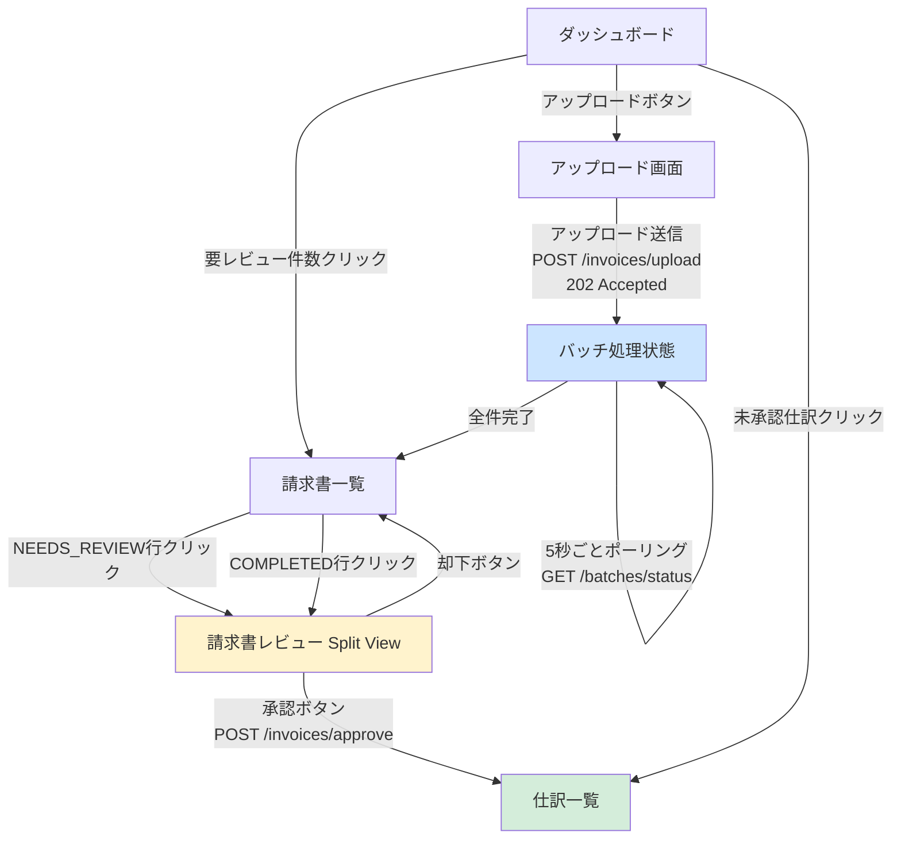

# Buổi 4 — Thiết kế màn hình: Wireframe & 画面仕様書

---

## Slide 1: Mục tiêu buổi học

### Sau buổi này bạn sẽ biết
- Nguyên tắc thiết kế Wireframe trong Basic Design (khác UI Design)
- Viết 画面仕様書 (Screen Specification) đầy đủ cho từng màn hình
- Thiết kế màn hình dựa trên DB đã thiết kế
- Thiết kế màn hình split-view cho review hóa đơn (điểm đặc trưng của AI-IA)
- Xử lý các case đặc biệt: processing state, empty state, loading, error state

### Ôn tập buổi 3
> **Quiz:** Partial Index là gì? Tại sao `(status, created_at)` composite index quan trọng hơn index đơn trên `status` khi có 100,000+ hóa đơn?

---

## Slide 2: Wireframe trong Basic Design là gì?

### Không phải UI Design — Không phải Mockup

```
Wireframe (Basic Design)        UI Design / Mockup
──────────────────────────────────────────────────
Mục tiêu: Xác định LAYOUT      Mục tiêu: Xác định ĐẸP
Công cụ: draw.io, Balsamiq      Công cụ: Figma, Sketch
Màu sắc: Trắng/xám             Màu sắc: Brand colors
Chi tiết: Component, dữ liệu   Chi tiết: Font, spacing, icon
Đọc bởi: Dev + BA + KH         Đọc bởi: Dev + Designer + KH
Thay đổi: Dễ dàng              Thay đổi: Tốn công
```

### Wireframe trong Basic Design cần thể hiện

- **Layout:** Vị trí các thành phần (header, sidebar, content, footer)
- **Components:** Button, table, form, modal, pagination, progress bar
- **Data:** Field nào hiển thị, từ đâu lấy
- **State:** Processing (6 states), Empty, loading, error, success
- **Action:** Nút nào làm gì, dẫn đến đâu

---

## Slide 3: Cấu trúc 画面仕様書 — 1 màn hình

### Template chuẩn cho mỗi màn hình

```
画面ID:    S010
画面名:    請求書一覧画面
URL:       /invoices
権限:      accountant, reviewer, admin
呼び出し:  ログイン後のダッシュボードからナビゲーション

【目的】
アップロードした請求書の一覧を表示し、処理状態を確認・操作できるようにする

【表示項目】
(表参照)

【操作・アクション】
(表参照)

【表示ロジック】
(ステータス別の表示ルール)

【エラー・例外】
(エラー時の表示)

【Wireframe】
(図参照)

【API】
GET /api/v1/invoices  ← この画面が使用するAPI
```

---

## Slide 4: Wireframe — S010 請求書一覧画面

```
┌──────────────────────────────────────────────────────────────┐
│  AI-IA   請求書   仕訳一覧   ダッシュボード      [田中 花子▼] │  ← Header
├──────────────────────────────────────────────────────────────┤
│  請求書一覧                          [+ 請求書をアップロード]  │
│                                                              │
│  ┌──────────────────────────────────────────────────────┐   │
│  │ ステータス: [全て▼]  期間: [開始日] 〜 [終了日]  🔍[ ]│   │  ← Filter
│  └──────────────────────────────────────────────────────┘   │
│                                                              │
│  1,250件中 1〜20件を表示                  [← 前] [次 →]     │
│                                                              │
│  ┌────────────────────────────────────────────────────────┐  │
│  │ ファイル名          │ ステータス      │ アップロード日 │操作│  │
│  ├────────────────────────────────────────────────────────┤  │
│  │ invoice_2026_03.pdf │ ✅ 完了         │ 2026/03/24    │[確認]│ ← COMPLETED
│  ├────────────────────────────────────────────────────────┤  │
│  │ scan_yamada.jpg     │ ⚠ 要レビュー   │ 2026/03/24    │[レビュー]│ ← NEEDS_REVIEW
│  ├────────────────────────────────────────────────────────┤  │
│  │ receipt_march.pdf   │ ⏳ 処理中       │ 2026/03/23    │[詳細]│ ← PROCESSING
│  ├────────────────────────────────────────────────────────┤  │
│  │ bills_batch2.pdf    │ ❌ 失敗         │ 2026/03/23    │[再処理]│ ← FAILED
│  └────────────────────────────────────────────────────────┘  │
│                                                              │
│                    [← 前] 1 2 3 ... 63 [次 →]              │
└──────────────────────────────────────────────────────────────┘

凡例:
✅ 完了 (COMPLETED)       = 緑
⚠ 要レビュー (NEEDS_REVIEW) = 黄
⏳ 処理中 (PROCESSING/QUEUED) = 青
❌ 失敗 (FAILED)           = 赤
📤 アップロード済 (UPLOADED) = グレー
```

---

## Slide 5: 画面仕様書 — S010 詳細定義

### 表示項目

| # | 項目名 | 表示内容 | データソース | 備考 |
|---|--------|---------|------------|------|
| 1 | ファイル名 | invoices.original_filename | invoices | クリックで詳細へ |
| 2 | ステータス | ステータスラベル+アイコン | invoices.status | 凡例参照 |
| 3 | アップロード日 | invoices.created_at | invoices | YYYY/MM/DD形式 |
| 4 | 金額 (任意) | invoice_extracted_data.total_amount | LEFT JOIN | NULLの場合「処理中」 |
| 5 | 操作ボタン | ステータス別 | — | 下表参照 |

### ステータス別ボタン表示ルール

| ステータス | ボタン | アクション |
|----------|--------|----------|
| UPLOADED | [詳細] (灰) | S011 詳細へ |
| QUEUED | [詳細] (灰) | S011 詳細へ |
| PROCESSING | [詳細] (青) | S011 詳細へ (polling表示) |
| COMPLETED | [確認] (緑) | S020 Review画面へ |
| NEEDS_REVIEW | [レビュー] (黄) | S020 Review画面へ (要対応バッジ) |
| FAILED | [再処理] (赤) | POST /invoices/{id}/retry |

### フィルター仕様

| フィルター | 選択肢 | デフォルト |
|----------|--------|---------|
| ステータス | 全て / 完了 / 要レビュー / 処理中 / 失敗 | 全て |
| 期間 | 日付範囲ピッカー | 過去30日 |
| 検索 | ファイル名検索 | 空 |

### Pagination仕様

| 項目 | 値 |
|------|-----|
| 1ページ表示件数 | 20件 |
| URLパラメータ | `?page=1&per=20&status=xxx&from=xxx&to=xxx&q=xxx` |

---

## Slide 6: Wireframe — S011 請求書詳細・処理状態画面

```
┌──────────────────────────────────────────────────────────────┐
│  AI-IA   請求書   仕訳一覧   ダッシュボード      [田中 花子▼] │
├──────────────────────────────────────────────────────────────┤
│  [← 請求書一覧に戻る]                                         │
│                                                              │
│  invoice_2026_03.pdf                                         │
│  アップロード: 2026/03/24 09:15:32 | サイズ: 2.3MB | PDF      │
│                                                              │
│  ┌────────────────────────────────────────────────────────┐  │
│  │  処理状態                                               │  │
│  │                                                        │  │
│  │  📤 UPLOADED → ⏳ QUEUED → ⚙ PROCESSING → ✅ COMPLETED │  │
│  │       ✅           ✅            ✅              ✅       │  │
│  │                                                        │  │
│  │  完了しました。AIが仕訳を提案しました。                  │  │
│  └────────────────────────────────────────────────────────┘  │
│                                                              │
│  ┌────────────────────────────────────────────────────────┐  │
│  │  AI抽出結果                        信頼スコア: 0.9234   │  │
│  ├────────────────────────────────────────────────────────┤  │
│  │  仕入先名: 株式会社サンプル電機                          │  │
│  │  請求書日付: 2026/03/15                                 │  │
│  │  請求書番号: INV-2026-0042                              │  │
│  │  合計金額: ¥110,000                                    │  │
│  │  消費税額: ¥10,000                                     │  │
│  └────────────────────────────────────────────────────────┘  │
│                                                              │
│                    [仕訳を確認・承認する →]                   │
└──────────────────────────────────────────────────────────────┘
```

---

## Slide 7: Wireframe — S020 請求書レビュー画面 (Split View)

> **これがAI-IAの核心画面です。** 左側に請求書の画像/PDF、右側にAI抽出結果と仕訳フォームを表示する Split View。

```
┌──────────────────────────────────────────────────────────────────────┐
│  AI-IA   請求書   仕訳一覧    ダッシュボード         [田中 花子▼]    │
├──────────────────────────────────────────────────────────────────────┤
│  [← 一覧に戻る]   invoice_2026_03.pdf   ⚠ 要レビュー (信頼度: 0.72)│
├────────────────────────────┬─────────────────────────────────────────┤
│                            │  AI抽出結果の確認                       │
│   [請求書の画像/PDF表示]    │  ─────────────────────────────────      │
│                            │  仕入先: [株式会社サンプル電機     ]   │
│   (MinIO SignedURLから      │  請求書日付: [2026/03/15       📅]     │
│    iframeまたは画像で表示)  │  請求書番号: [INV-2026-0042      ]     │
│                            │  合計金額: [¥ 110,000           ]     │
│   ← スクロール可能 →        │  消費税額: [¥   10,000           ]     │
│                            │                                        │
│   [拡大] [縮小] [↺回転]    │  ─────────────────────────────────      │
│                            │  AI提案仕訳                            │
│                            │  借方: [5101  仕入高          ] ¥100,000│
│                            │  貸方: [2101  買掛金          ] ¥100,000│
│                            │  借方: [5103  仮払消費税       ] ¥10,000 │
│                            │  貸方: [2101  買掛金          ] ¥10,000  │
│                            │                                        │
│                            │  摘要: [株式会社サンプル電機 3月分   ]  │
│                            │                                        │
│                            │  [✗ 却下]        [✅ 承認して登録する]  │
└────────────────────────────┴─────────────────────────────────────────┘
```

### 設計ポイント
```
【重要設計判断】
左ペイン: MinIO Signed URL (30分有効) で請求書ファイルを直接表示
→ Flutter WebViewまたは<iframe>でPDF/画像を表示
→ URLを直接フロントに渡さない (LaravelがSigned URLを生成して返す)
→ セキュリティ: Signed URLは30分で失効 → ファイルの永続公開URL禁止

右ペイン: AI抽出データ + 編集可能フォーム
→ confidence_score < 0.85 なら各フィールドに ⚠ マーク
→ 仕訳は追加・削除可能 (複数行対応)
→ 「承認」ボタン → POST /api/v1/invoices/{id}/approve
```

---

## Slide 8: Wireframe — S030 請求書アップロード画面

```
┌──────────────────────────────────────────────────────────────┐
│  AI-IA   請求書   仕訳一覧   ダッシュボード      [田中 花子▼] │
├──────────────────────────────────────────────────────────────┤
│  請求書アップロード                                            │
│                                                              │
│  ┌──────────────────────────────────────────────────────┐   │
│  │                                                      │   │
│  │   📁 ここにファイルをドロップ、またはクリックして選択   │   │
│  │                                                      │   │
│  │   対応形式: PDF, JPEG, PNG, WEBP                     │   │
│  │   最大サイズ: 1ファイル10MB、1バッチ最大50ファイル     │   │
│  │                                                      │   │
│  └──────────────────────────────────────────────────────┘   │
│                                                              │
│  選択済みファイル (3件):                                      │
│  ┌──────────────────────────────────────────────────────┐   │
│  │ ✅ invoice_march.pdf    (2.3MB)                 [削除]│   │
│  │ ✅ receipt_001.jpg      (0.8MB)                 [削除]│   │
│  │ ✅ bill_electric.pdf    (1.2MB)                 [削除]│   │
│  └──────────────────────────────────────────────────────┘   │
│                                                              │
│  ⚠ アップロード後、AIが自動で処理します（約5秒/件）          │
│  50件のバッチ処理は最大10分かかる場合があります              │
│                                                              │
│        [キャンセル]    [アップロードして処理開始 (3件)]        │
└──────────────────────────────────────────────────────────────┘

バリデーション:
・ファイル形式: PDF, JPEG, PNG, WEBP のみ
・ファイルサイズ: 1ファイル最大10MB
・バッチ上限: 50ファイル
・Laravelでバリデーション (Flutterは UX用のみ)
```

---

## Slide 9: Wireframe — S031 バッチ処理状態画面

> **非同期処理のUX設計:** アップロード後、Flutter がポーリングで状態を確認する。

```
┌──────────────────────────────────────────────────────────────┐
│  AI-IA   請求書   仕訳一覧   ダッシュボード      [田中 花子▼] │
├──────────────────────────────────────────────────────────────┤
│  バッチ処理状態  BATCH-20260324-001                           │
│                                                              │
│  全体進捗:                                                    │
│  ████████████████████░░░░░░░  38 / 50  (76%)               │
│                                                              │
│  ┌──────────────────────────────────────────────────────┐   │
│  │ ステータス | 件数 | 割合                              │   │
│  ├──────────────────────────────────────────────────────┤   │
│  │ ✅ 完了      │  32 │ 64%                             │   │
│  │ ⚠ 要レビュー │   6 │ 12%                             │   │
│  │ ⏳ 処理中    │   4 │  8%                             │   │
│  │ ⏳ 待機中    │   6 │ 12%                             │   │
│  │ ❌ 失敗      │   2 │  4%                             │   │
│  └──────────────────────────────────────────────────────┘   │
│                                                              │
│  ⟳ 5秒ごとに自動更新中...                                    │
│                                                              │
│  処理完了後にメール通知でお知らせします                        │
│                                                              │
│  [失敗した件数を再処理]    [完了した仕訳を確認する →]         │
└──────────────────────────────────────────────────────────────┘

設計メモ:
→ Flutter は GET /api/v1/batches/{id}/status を5秒ごとにポーリング
→ 全件 COMPLETED または FAILED になったら自動停止
→ WebSocketではなくポーリングを採用 (インフラシンプル化)
```

---

## Slide 10: Wireframe — S040 仕訳一覧画面

```
┌──────────────────────────────────────────────────────────────┐
│  AI-IA   請求書   仕訳一覧   ダッシュボード      [田中 花子▼] │
├──────────────────────────────────────────────────────────────┤
│  仕訳一覧                                                     │
│                                                              │
│  ┌──────────────────────────────────────────────────────┐   │
│  │ 承認状態: [全て▼]  期間: [開始日]〜[終了日]  🔍[検索 ]│   │
│  └──────────────────────────────────────────────────────┘   │
│                                                              │
│  ┌────────────────────────────────────────────────────────┐  │
│  │ 請求書          │ 借方        │ 貸方    │ 金額      │承認│  │
│  ├────────────────────────────────────────────────────────┤  │
│  │invoice_03.pdf   │仕入高(5101) │買掛金   │¥100,000  │ ✅ │  │
│  ├────────────────────────────────────────────────────────┤  │
│  │scan_yamada.jpg  │通信費(6200) │買掛金   │ ¥22,000  │ ⏳ │  │
│  ├────────────────────────────────────────────────────────┤  │
│  │receipt_002.jpg  │旅費(6300)   │現金     │  ¥5,400  │ ✅ │  │
│  └────────────────────────────────────────────────────────┘  │
│                                                              │
│                    [← 前] 1 2 3 ... 25 [次 →]              │
└──────────────────────────────────────────────────────────────┘

凡例:
✅ 承認済み  = 緑
⏳ 未承認    = 黄
```

---

## Slide 11: Empty State / Loading / Processing State の設計

### 各Stateの設計も画面仕様書に含める

**Empty State — 請求書一覧 (0件の場合)**
```
┌──────────────────────────────────┐
│                                  │
│        📄                        │
│  まだ請求書がありません           │
│                                  │
│  [最初の請求書をアップロード]     │
│                                  │
└──────────────────────────────────┘
```

**Processing State — AI処理中 (ポーリング)**
```
┌──────────────────────────────────┐
│  ⚙ AIが処理中です...            │
│  ████████░░░░  60%              │
│                                  │
│  通常5秒程度で完了します         │
│  [キャンセル]                    │
└──────────────────────────────────┘
```

**Error State — AI処理失敗**
```
┌──────────────────────────────────┐
│  ❌ AI処理に失敗しました         │
│  エラー: ファイルが読み取れません │
│                                  │
│  [再処理する]  [手動で入力する]   │
└──────────────────────────────────┘
```

**画面仕様書への記載:**
```
【状態別表示】
・通常: テーブル表示（20件/ページ）
・0件: Empty State (図3参照)
・ポーリング中: Processing State (図4参照)
・API失敗: エラーバナー + 再試行ボタン
```

---

## Slide 12: 画面仕様書 全体マップ

### AI-IA 全画面の対応表

| 画面ID | 画面名 | 担当API | 備考 |
|--------|--------|--------|------|
| S001 | ログイン | POST /auth/login | |
| S002 | PW変更 | PUT /auth/password | |
| S005 | ダッシュボード | GET /dashboard | 未処理件数、要レビュー件数 |
| S010 | 請求書一覧 | GET /invoices | Filter/Pagination |
| S011 | 請求書詳細・処理状態 | GET /invoices/{id}/status | ポーリング |
| S020 | 請求書レビュー (Split View) | GET /invoices/{id} | 核心画面 |
| S021 | 仕訳確認・編集 | PUT /journal-entries/{id} | |
| S030 | 請求書アップロード | POST /invoices/upload | multipart, 202 Async |
| S031 | バッチ処理状態 | GET /batches/{id}/status | ポーリング |
| S040 | 仕訳一覧 | GET /journal-entries | Filter/Pagination |
| S041 | 仕訳詳細 | GET /journal-entries/{id} | |
| S100 | Admin: ユーザー管理 | GET/POST/PUT /admin/users | Admin |
| S110 | Admin: 仕入先マスタ | GET/POST/PUT /admin/suppliers | Admin |
| S111 | Admin: 勘定科目マッピング | GET/POST/PUT /admin/account-codes | Admin |
| S120 | Admin: レポート | GET /admin/reports | Admin |
| S130 | Admin: システム設定 | GET/PUT /admin/settings | Admin |

---

## Slide 13: 画面設計のチェックリスト

### 画面仕様書提出前の確認

**データ面**
- [ ] 全表示項目のデータソース（テーブル.カラム）が明記されている
- [ ] NULL値の場合の表示が定義されている
- [ ] ソート順が定義されている

**ロジック面**
- [ ] 権限によって表示/非表示が切り替わる部分が定義されている
- [ ] ステータス別のボタン表示ルールが定義されている
- [ ] バリデーションエラーの表示箇所が定義されている
- [ ] **AI処理の6ステータスが全て画面で表現されている** ← AI-IA特有

**State面**
- [ ] Empty State のデザインが定義されている
- [ ] ローディング状態が定義されている
- [ ] APIエラー時の表示が定義されている
- [ ] **Processing State (AI処理中) のポーリング仕様が定義されている** ← AI-IA特有

**操作面**
- [ ] 全ボタン・リンクのアクションが定義されている
- [ ] 遷移先画面IDが明記されている
- [ ] **Split Viewの左右ペイン仕様が明記されている** ← レビュー画面特有

---

## Slide 14: Thực hành tại lớp (30 phút)

### Bài tập — Vẽ Wireframe cho S005 ダッシュボード画面

**Yêu cầu:**
Dashboard cần hiển thị:
- Số hóa đơn cần review (NEEDS_REVIEW) → Click dẫn đến S010 (filter: NEEDS_REVIEW)
- Số hóa đơn đang xử lý (PROCESSING + QUEUED) → Click dẫn đến S010
- Số bút toán chưa phê duyệt → Click dẫn đến S040
- Danh sách 5 hóa đơn mới nhất cần xử lý
- Tỷ lệ thành công AI trong 7 ngày gần nhất (số COMPLETED / tổng)

**Nhiệm vụ:**
1. Vẽ Wireframe bằng draw.io hoặc vẽ tay (ASCII art cũng được)
2. Liệt kê Data Source cho từng widget
3. Xác định API cần thiết để lấy dữ liệu

---

## Slide 14b: AI活用 — Wireframe & 画面遷移図を自動生成する

### ツール別用途マップ

| ツール | 得意な図 | 特徴 | 料金 |
|--------|---------|------|------|
| **v0.dev** (Vercel) | Wireframe → 実コード | React/HTML生成、クリック可能 | 無料(制限あり) |
| **Whimsical AI** | Wireframe, Flowchart | 自然言語から即生成、シンプル | 無料(制限あり) |
| **Claude + Mermaid** | 画面遷移図, Flowchart | テキストで正確に制御可能 | Claude利用料のみ |
| **Eraser.io** | Architecture, Flowchart | AI prompt → 図生成 | 無料(free tier) |

---

### Tool 1: v0.dev — Wireframeをコード付きで生成

**プロンプトテンプレート — 請求書レビュー画面 (Split View):**
```
AI請求書自動処理システムのレビュー画面を作成してください。

要件:
- Split View: 左50%に請求書PDF/画像のビューア、右50%にフォーム
- 左ペイン: iframeでPDF表示、拡大縮小ボタン、回転ボタン
- 右ペイン:
  - AI抽出結果フォーム (仕入先名, 日付, 金額, 消費税額)
  - 信頼スコア表示 (例: 0.72 → 黄色の警告)
  - AI提案仕訳テーブル (借方/貸方/金額, 複数行)
  - 「承認して登録」ボタン (緑) と「却下」ボタン (赤)
- ヘッダー: ファイル名と処理状態バッジ
- 信頼スコアが0.85未満のフィールドに ⚠ アイコン

TailwindCSS + shadcn/ui を使用してください。
```

---

### Tool 2: Claude + Mermaid — 画面遷移図を生成

**プロンプトテンプレート:**
```
AI請求書自動処理システムの画面遷移図を
Mermaid flowchart形式で書いてください。

対象フロー: 請求書アップロードから仕訳承認までの主要フロー
画面:
- S005: ダッシュボード
- S010: 請求書一覧
- S030: アップロード画面
- S031: バッチ処理状態
- S020: 請求書レビュー (Split View)
- S040: 仕訳一覧
- S011: 請求書詳細

遷移条件も矢印のラベルに記載してください。
非同期処理（ポーリング）を表現してください。
```

**AIが生成するMermaid:**



---

### Tool 3: Whimsical AI — 自然言語からFlowchart

**プロンプト例:**
```
AI請求書処理システムで会計士がレビューするワークフローを
フローチャートで描いてください:
請求書一覧確認 → NEEDS_REVIEWをクリック →
Split Viewで請求書とAI抽出結果を比較 →
内容確認・修正 → 仕訳確認 → 承認または却下
承認: journal_entriesに登録 → 完了通知
却下: 理由入力 → 再処理またはスキップ
```

---

### AI活用のベストプラクティス

```
✅ 効果的な使い方:
  1. ドラフト生成にAIを使う（完成品ではなくたたき台）
  2. 生成されたものを必ず人間がレビュー・修正する
  3. プロンプトに「システムの背景情報」を毎回含める
  4. 「〇〇形式で出力」と出力フォーマットを指定する

❌ 注意点:
  - AIが生成した図をそのまま提出しない
  - 機密情報（本番URLや認証情報）をプロンプトに含めない
  - 生成結果のビジネスロジックが正しいかは人間が確認する
```

---

## Slide 15: Tóm tắt buổi 4 & Bài tập về nhà

### Tóm tắt
- Wireframe trong Basic Design = Layout + Data + State + Action
- AI-IA đặc trưng: Split View review screen + 6 processing states + polling UX
- Mỗi màn hình cần định nghĩa: Empty / Processing / Error State
- Tất cả cột hiển thị phải có Data Source (table.column)
- Signed URL cho file hóa đơn: không public URL, 30 phút hết hạn

### Bài tập về nhà
> Viết 画面仕様書 đầy đủ (Wireframe + Spec Table) cho 3 màn hình:
>
> 1. **S005 — ダッシュボード** (Hiển thị số liệu tổng hợp + hóa đơn cần xử lý)
> 2. **S040 — 仕訳一覧** (Danh sách bút toán với filter và pagination)
> 3. **S120 — Admin レポート** (Báo cáo tỷ lệ xử lý AI theo tuần/tháng)
>
> Mỗi màn hình cần có: Wireframe + Bảng item + ステータス別ルール + API使用先

### Buổi sau
**Buổi 5:** Thiết kế API & Interface — RESTful API Design + Async Processing API
