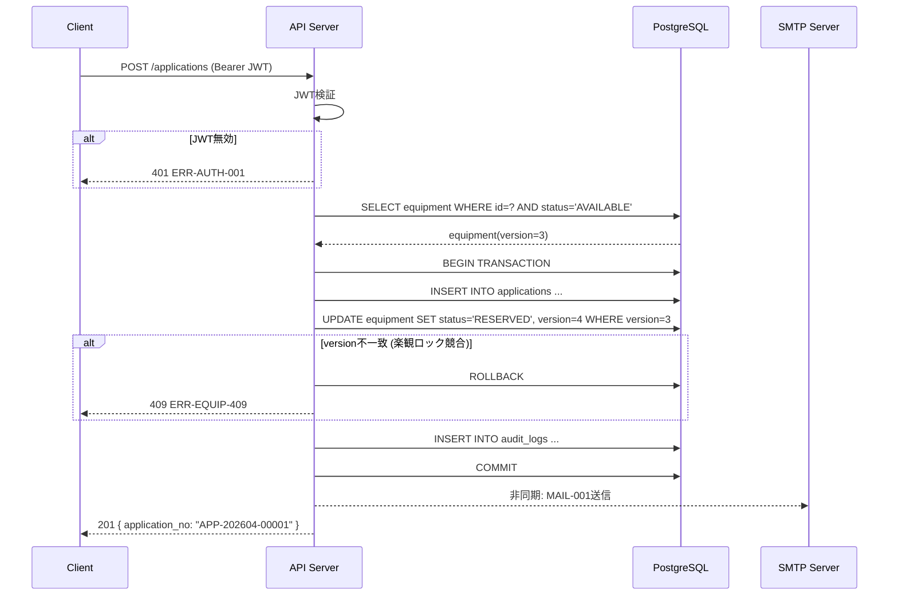

# Buổi 5 — Thiết kế API & Interface (インターフェース設計)

---

## Slide 1: Mục tiêu buổi học

### Sau buổi này bạn sẽ biết
- Nguyên tắc thiết kế RESTful API đúng chuẩn
- Viết API仕様書 với request/response đầy đủ
- Định nghĩa Error Code thống nhất
- Thiết kế phân trang, filter, sort chuẩn
- Xử lý External Interface (SMTP, file upload)

### Ôn tập buổi 4
> **Quiz:** Data Source của bảng "貸出履歴" trong S021 là table nào + JOIN gì?

---

## Slide 2: Tại sao API Design quan trọng?

### Hậu quả của API Design kém

| Vấn đề | Nguyên nhân | Chi phí sửa |
|--------|------------|------------|
| Frontend phải gọi 5 API cho 1 màn hình | API quá granular | Cao (refactor nhiều nơi) |
| N+1 Query problem | API không có JOIN/include | Rất cao |
| Frontend không biết xử lý lỗi gì | Error code không định nghĩa | Trung bình |
| List API trả về 10,000 records | Thiếu pagination | Rất cao (data đã to) |
| Breaking change sau release | Thiếu versioning | Rất cao |

### Nguyên tắc vàng
> API Design xong → Frontend và Backend dev độc lập → Giảm phụ thuộc

---

## Slide 3: RESTful API — Quy tắc cơ bản

### HTTP Method & Resource Mapping

| Method | Path | Ý nghĩa | Ví dụ |
|--------|------|---------|-------|
| GET | /equipment | Lấy danh sách | Danh sách thiết bị |
| GET | /equipment/{id} | Lấy 1 record | Chi tiết thiết bị |
| POST | /equipment | Tạo mới | Đăng ký thiết bị |
| PUT | /equipment/{id} | Cập nhật toàn bộ | Sửa thiết bị |
| PATCH | /equipment/{id} | Cập nhật 1 phần | Đổi status |
| DELETE | /equipment/{id} | Xóa | Xóa thiết bị (soft) |

### URL Naming Rules

```
✅ Đúng:
GET  /equipment                    (danh từ, số nhiều)
GET  /equipment/{id}/applications  (nested resource)
GET  /admin/equipment              (admin prefix)
POST /applications/{id}/approve    (action verb cho endpoint đặc biệt)

❌ Sai:
GET  /getEquipment                 (verb trong URL)
GET  /Equipment                    (PascalCase)
GET  /equipment_list               (underscore)
GET  /api/v1/get-all-equipment     (quá verbose)
```

---

## Slide 4: API一覧 — Hệ thống thiết bị

### Authentication

| Method | Path | Mô tả | Auth |
|--------|------|-------|------|
| POST | /auth/login | Đăng nhập | ❌ |
| POST | /auth/logout | Đăng xuất | ✅ |
| GET | /auth/me | Lấy thông tin user hiện tại | ✅ |
| PUT | /auth/password | Đổi mật khẩu | ✅ |

### Equipment (User + Admin)

| Method | Path | Mô tả | Auth | Role |
|--------|------|-------|------|------|
| GET | /equipment | Danh sách thiết bị | ✅ | All |
| GET | /equipment/{id} | Chi tiết thiết bị | ✅ | All |

### Equipment (Admin only)

| Method | Path | Mô tả | Auth | Role |
|--------|------|-------|------|------|
| POST | /admin/equipment | Đăng ký thiết bị | ✅ | Admin |
| PUT | /admin/equipment/{id} | Cập nhật thiết bị | ✅ | Admin |
| PATCH | /admin/equipment/{id}/status | Đổi status thủ công | ✅ | Admin |
| DELETE | /admin/equipment/{id} | Xóa (soft) thiết bị | ✅ | Admin |
| POST | /admin/equipment/import | CSV import | ✅ | Admin |

### Applications

| Method | Path | Mô tả | Auth | Role |
|--------|------|-------|------|------|
| POST | /applications | Gửi đơn mượn | ✅ | User |
| GET | /my/applications | Đơn mượn của tôi | ✅ | User |
| GET | /my/applications/{id} | Chi tiết đơn | ✅ | User |
| DELETE | /my/applications/{id} | Hủy đơn (PENDING) | ✅ | User |
| POST | /applications/{id}/return | Yêu cầu trả | ✅ | User |
| GET | /admin/applications | Tất cả đơn | ✅ | Admin |
| POST | /admin/applications/{id}/approve | Phê duyệt | ✅ | Admin |
| POST | /admin/applications/{id}/reject | Từ chối | ✅ | Admin |
| POST | /admin/applications/{id}/confirm-return | Xác nhận trả | ✅ | Admin |

---

## Slide 5: API仕様書 — GET /equipment (List)

```yaml
## GET /equipment — 機器一覧取得

### リクエスト

Headers:
  Authorization: Bearer {jwt_token}

Query Parameters:
  | Name       | Type    | Required | Default | Description              |
  |------------|---------|----------|---------|--------------------------|
  | page       | integer | No       | 1       | ページ番号 (1始まり)       |
  | per        | integer | No       | 20      | 1ページ件数 (max: 100)    |
  | category_id| uuid    | No       | null    | カテゴリでフィルター       |
  | status     | string  | No       | null    | ステータスでフィルター     |
  | q          | string  | No       | null    | 機器名・シリアルで全文検索 |
  | sort       | string  | No       | created_at | ソート項目: name, created_at |
  | order      | string  | No       | desc    | asc / desc               |

### レスポンス 200 OK

{
  "data": [
    {
      "id": "550e8400-e29b-41d4-a716-446655440000",
      "name": "MacBook Pro 14\" (M3 Pro)",
      "category": {
        "id": "...",
        "name": "PC・ノートPC"
      },
      "status": "AVAILABLE",
      "status_label": "利用可能",
      "location": "東京オフィス 3F",
      "serial_no": "C02XL1234ABCD",
      "thumbnail_url": "https://storage.example.com/equipment/xxx.jpg"
    }
  ],
  "meta": {
    "total": 500,
    "page": 1,
    "per": 20,
    "total_pages": 25
  }
}

### レスポンス 401 Unauthorized
{ "error": { "code": "ERR-AUTH-001", "message": "認証が必要です" } }

### レスポンス 400 Bad Request (バリデーションエラー)
{
  "error": {
    "code": "ERR-VALID-001",
    "message": "入力値が不正です",
    "details": [
      { "field": "per", "message": "100以下の値を指定してください" }
    ]
  }
}
```

---

## Slide 6: API仕様書 — POST /applications (申請)

```yaml
## POST /applications — 貸出申請

### リクエスト

Headers:
  Authorization: Bearer {jwt_token}
  Content-Type: application/json

Body:
{
  "equipment_id": "550e8400-e29b-41d4-a716-446655440000",
  "start_date": "2026-04-01",
  "return_date": "2026-04-14",
  "purpose": "出張先でのシステム開発作業のため"
}

Body Validation:
  | Field        | Type   | Required | Rule                           |
  |--------------|--------|----------|--------------------------------|
  | equipment_id | uuid   | ✓        | 存在する機器IDであること         |
  | start_date   | date   | ✓        | 本日以降                        |
  | return_date  | date   | ✓        | start_date より後               |
  |              |        |          | カテゴリの max_days 以内         |
  | purpose      | string | ✓        | 1〜500文字                      |

### レスポンス 201 Created

{
  "data": {
    "id": "...",
    "application_no": "APP-202604-00001",
    "status": "PENDING",
    "equipment": {
      "id": "...",
      "name": "MacBook Pro 14\""
    },
    "start_date": "2026-04-01",
    "return_date": "2026-04-14",
    "created_at": "2026-03-24T09:15:32+09:00"
  }
}

### レスポンス 409 Conflict (楽観ロック / 機器が既に申請済み)
{
  "error": {
    "code": "ERR-EQUIP-409",
    "message": "この機器は現在申請できません。最新の状態を確認してください。"
  }
}

### レスポンス 422 Unprocessable (業務ルール違反)
{
  "error": {
    "code": "ERR-APPLY-422",
    "message": "PCは同時に1台のみ借りられます",
    "details": {
      "category": "PC・ノートPC",
      "current_borrowed": 1,
      "max_per_user": 1
    }
  }
}
```

---

## Slide 7: エラーコード設計

### エラーコード命名規則

**フォーマット:** `ERR-[MODULE]-[CODE]`

| モジュール | Prefix | 例 |
|----------|--------|-----|
| 認証・認可 | AUTH | ERR-AUTH-001 |
| バリデーション | VALID | ERR-VALID-001 |
| 機器 | EQUIP | ERR-EQUIP-001 |
| 申請 | APPLY | ERR-APPLY-001 |
| DB | DB | ERR-DB-001 |
| システム | SYS | ERR-SYS-001 |

### エラーコード一覧 (主要)

| コード | HTTPステータス | メッセージ (日本語) | 発生条件 |
|--------|-------------|------------------|---------|
| ERR-AUTH-001 | 401 | 認証が必要です | トークンなし/期限切れ |
| ERR-AUTH-002 | 403 | この操作は許可されていません | 権限不足 |
| ERR-AUTH-003 | 401 | メールまたはパスワードが正しくありません | ログイン失敗 |
| ERR-AUTH-004 | 423 | アカウントがロックされています | 5回失敗 |
| ERR-VALID-001 | 400 | 入力値が不正です | バリデーション失敗 |
| ERR-EQUIP-001 | 404 | 機器が見つかりません | 存在しないID |
| ERR-EQUIP-409 | 409 | この機器は現在申請できません | 競合 / ステータス変化 |
| ERR-EQUIP-410 | 410 | この機器は廃棄済みです | DISPOSED機器へアクセス |
| ERR-APPLY-001 | 404 | 申請が見つかりません | 存在しないID |
| ERR-APPLY-422 | 422 | 貸出上限に達しています | カテゴリ上限超過 |
| ERR-APPLY-422B | 422 | 返却期間が上限を超えています | max_days超過 |
| ERR-DB-001 | 500 | サーバーエラーが発生しました | DB接続失敗 |
| ERR-SYS-001 | 500 | 予期しないエラーが発生しました | Unhandled exception |

---

## Slide 8: Authentication Design — JWT

### JWT フロー

```
[Client]                        [Server]
   │                                │
   │  POST /auth/login              │
   │  { email, password }           │
   │ ─────────────────────────────> │
   │                                │ 1. パスワード検証 (bcrypt)
   │                                │ 2. JWT生成
   │                                │ 3. Redis にリフレッシュトークン保存
   │  200 OK                        │
   │  { access_token (15分),        │
   │    refresh_token (7日) }       │
   │ <───────────────────────────── │
   │                                │
   │  GET /equipment                │
   │  Authorization: Bearer {JWT}   │
   │ ─────────────────────────────> │
   │                                │ 1. JWT署名検証
   │                                │ 2. 有効期限確認
   │                                │ 3. ユーザー権限確認
   │  200 OK { data: [...] }        │
   │ <───────────────────────────── │
```

### JWT Payload設計

```json
{
  "sub": "user-uuid-xxxx",
  "email": "yamada@company.co.jp",
  "role": "user",
  "department_id": "dept-uuid-xxxx",
  "iat": 1711234567,
  "exp": 1711235467
}
```

**設計メモ:** JWTには最低限の情報のみ。個人情報や機密情報は入れない。

---

## Slide 9: Pagination & Filter の統一設計

### 全Listエンドポイントの共通仕様

```
Query Parameters (共通):
  page      : integer, default=1, min=1
  per       : integer, default=20, max=100
  sort      : string, テーブルごとに許可するカラムを定義
  order     : 'asc' | 'desc', default='desc'

Response Meta (共通):
  {
    "meta": {
      "total":       500,   // 全件数
      "page":        1,     // 現在ページ
      "per":         20,    // 1ページ件数
      "total_pages": 25     // 総ページ数
    }
  }
```

### equipmentの許可sortカラム
```
name, status, category_id, location, purchase_date, created_at
```

### applicationsの許可sortカラム
```
application_no, start_date, return_date, status, created_at
```

---

## Slide 10: 外部インターフェース — メール送信

### 外部IF一覧

| IF名 | 方式 | 方向 | 用途 | タイミング |
|------|------|------|------|---------|
| SMTPメール送信 | SMTP | 送信 | 各種通知メール | イベント発生時 + バッチ |

### メールIF仕様

```
接続先:   社内SMTPサーバー (smtp.company.internal)
ポート:   587 (STARTTLS)
認証:     SMTP Auth (ユーザー名/パスワード)
送信元:   equipment-system@company.co.jp
エラー処理: 送信失敗 → DBにエラー記録 → 15分後に1回リトライ
```

### メールテンプレート一覧

| テンプレートID | 件名 | トリガー | 送信先 |
|-------------|------|---------|------|
| MAIL-001 | 【申請受付】{application_no} | 申請作成 | Admin全員 |
| MAIL-002 | 【承認】{application_no} | 承認時 | 申請者 |
| MAIL-003 | 【却下】{application_no} | 却下時 | 申請者 |
| MAIL-004 | 【返却期限3日前】{equipment_name} | バッチ | 申請者 |
| MAIL-005 | 【返却期限超過】{equipment_name} | バッチ | 申請者+Admin |
| MAIL-006 | 【返却確認完了】{application_no} | 返却確認時 | 申請者 |

---

## Slide 11: ファイルアップロード — 機器写真

### 画像アップロード仕様

```yaml
## POST /admin/equipment/{id}/images — 機器写真アップロード

リクエスト:
  Content-Type: multipart/form-data
  Body:
    image: (binary) 写真ファイル
    is_primary: boolean (メイン画像フラグ)

バリデーション:
  - ファイル形式: JPEG, PNG, WebP のみ
  - ファイルサイズ: 最大 5MB
  - ファイル数: 機器1台につき最大5枚

処理フロー:
  1. ファイル受信 → ウイルスチェック (ClamAV)
  2. リサイズ: 1200px × 900px (アスペクト比維持)
  3. WebP変換 (圧縮率向上)
  4. ローカルストレージ保存: /data/equipment-images/{equipment_id}/{uuid}.webp
  5. URLをDB登録

保存先: /data/equipment-images/ (on-premise サーバー)
URL形式: https://internal.company.co.jp/files/equipment/{equipment_id}/{uuid}.webp
アクセス制御: Nginxで認証チェック付き配信
```

---

## Slide 12: Thực hành tại lớp (25 phút)

### Bài tập — Viết API Spec cho Admin Approve

**Thiết kế API:** `POST /admin/applications/{id}/approve`

**Yêu cầu nghiệp vụ (từ Yokenteigi F034):**
- Admin phê duyệt đơn mượn
- Status thiết bị thay đổi:
  - Nếu `start_date` = hôm nay → `BORROWED`
  - Nếu `start_date` > hôm nay → `RESERVED`
- Gửi email thông báo cho User
- Optimistic locking

**Nhiệm vụ, viết đầy đủ:**
1. Request headers + body
2. Response 200 (success) với body đầy đủ
3. Response cho các error cases:
   - 404 (đơn không tồn tại)
   - 403 (không phải Admin)
   - 409 (đơn đã được xử lý rồi)
   - 500 (DB error)

---

## Slide 12b: AI活用 — API仕様書 & Sequence Diagramを自動生成する

### ユースケース別ツール

| 目的 | ツール | 出力形式 |
|------|--------|---------|
| API仕様書ドラフト作成 | **Claude / ChatGPT** | Markdown / OpenAPI YAML |
| Sequence Diagram | **Claude + Mermaid** | Mermaid sequenceDiagram |
| OpenAPI → Swagger UI | **Swagger Editor** | インタラクティブUI |
| APIテスト | **Bruno / Postman** | コレクション |

---

### プロンプトテンプレート 1 — API仕様書ドラフト生成

```
以下の仕様でRESTful APIの仕様書をMarkdown形式で書いてください。

システム: 社内機器管理・貸出システム
エンドポイント: POST /applications (貸出申請)

要件:
- 認証: JWT Bearer Token必須
- リクエストBody: equipment_id(UUID), start_date(date),
  return_date(date), purpose(string 最大500文字)
- 処理:
  1. バリデーション(日付範囲、カテゴリの最大日数チェック)
  2. 同カテゴリの貸出上限チェック(PCは1台まで)
  3. 楽観ロックで機器ステータスをRESERVEDに更新
  4. 申請レコード作成
  5. AdminへMETA-001通知メール送信
- レスポンス: 201, 400, 401, 409, 422, 500

エラーコード形式: ERR-[MODULE]-[CODE]
レスポンスフォーマット:
  成功: { "data": {...} }
  失敗: { "error": { "code": "...", "message": "...", "details": [...] } }
```

---

### AIが生成する出力例 (抜粋)

```markdown
## POST /applications — 貸出申請

### リクエスト
...（自動生成）...

### レスポンス 201 Created
{
  "data": {
    "id": "uuid",
    "application_no": "APP-202604-00001",
    "status": "PENDING",
    ...
  }
}

### エラー一覧
| コード | HTTP | 説明 |
|--------|------|------|
| ERR-AUTH-001 | 401 | 認証が必要です |
| ERR-EQUIP-409 | 409 | 機器が既に申請済みです |
| ERR-APPLY-422 | 422 | 貸出上限に達しています |
```

---

### プロンプトテンプレート 2 — Sequence Diagram生成

```
以下のAPI処理フローをMermaid sequenceDiagram形式で書いてください。

フロー: 貸出申請 (POST /applications)
参加者: Client(ブラウザ), API Server, PostgreSQL DB, Redis, SMTP Server

処理順:
1. ClientがJWT付きリクエスト送信
2. API ServerがJWT検証
3. APIがDBでequipmentの状態確認(楽観ロック)
4. APIがDBにapplicationをINSERT
5. APIがDBのequipment.statusをRESERVEDに更新(version+1)
6. APIがSMTPでAdminに通知メール送信(非同期)
7. APIが201レスポンスを返す

エラーケース:
- JWT無効 → 401を返す
- equipment.versionが変わっていた → 409を返す (ロールバック)
```

---

### AIが生成するMermaid Sequence Diagram



---

### プロンプトテンプレート 3 — OpenAPI YAML生成

```
以下のAPI一覧をOpenAPI 3.0 YAML形式で書いてください。
最初の3エンドポイントだけでOKです。

1. GET /equipment
   - クエリパラメータ: page, per, category_id, status, q
   - レスポンス: 機器一覧 + メタ情報(total, page, per, total_pages)

2. POST /applications
   - リクエストBody: equipment_id, start_date, return_date, purpose
   - レスポンス: 作成した申請情報

3. POST /admin/applications/{id}/approve
   - パスパラメータ: id (申請ID)
   - レスポンス: 承認後の申請情報

共通:
- 全エンドポイントにBearer JWT認証
- エラーレスポンスは ErrorResponse スキーマを再利用
```

> → 生成されたYAMLを **Swagger Editor** (editor.swagger.io) に貼り付けると
> インタラクティブなAPIドキュメントが即完成 ✨

---

### プロンプト精度を上げる3つのコツ

```
コツ 1: 「システムコンテキスト」を毎回冒頭に入れる
  ──────────────────────────────────────────────────
  あなたは社内機器管理・貸出システムのAPI設計者です。
  ユーザーとAdminの2ロールがあります。
  DBはPostgreSQL、認証はJWT(RS256)を使います。
  ──────────────────────────────────────────────────
  → AIが毎回「何のシステムか」を忘れない

コツ 2: 既存の出力を改善させる
  ──────────────────────────────────────────────────
  上記のAPI仕様書に以下を追加してください:
  - レートリミット仕様 (ヘッダーで返す形式)
  - 認可エラー (403) のケースを追加
  ──────────────────────────────────────────────────
  → 一から書かせるより、改善の方が精度が高い

コツ 3: 「何が足りないか」を聞く
  ──────────────────────────────────────────────────
  この API 仕様書で抜けているエラーケースや
  考慮すべきエッジケースを指摘してください
  ──────────────────────────────────────────────────
  → AIをレビュアーとして活用する
```

---

## Slide 13: Tóm tắt buổi 5 & Bài tập về nhà

### Tóm tắt
- RESTful: noun URL + HTTP method = rõ ràng và nhất quán
- Luôn define Error Code với format `ERR-MODULE-CODE`
- Pagination `page/per/total/total_pages` phải thống nhất toàn bộ API
- JWT payload: tối giản, không nhạy cảm
- External IF: định nghĩa timeout, retry, error handling

### Bài tập về nhà
> Hoàn thiện API Spec cho các endpoint sau:
>
> 1. `GET /admin/applications` — Danh sách tất cả đơn (có filter: status, date range, user_id)
> 2. `POST /admin/applications/{id}/confirm-return` — Xác nhận trả (bao gồm trường hợp "có hỏng")
> 3. `GET /admin/reports/utilization` — Báo cáo tỷ lệ sử dụng theo category (date range)
>
> Mỗi API cần: URL, method, query/body params, response 200, response error cases

### Buổi sau
**Buổi 6:** Thiết kế Batch & Security — Xử lý tự động và bảo mật hệ thống
