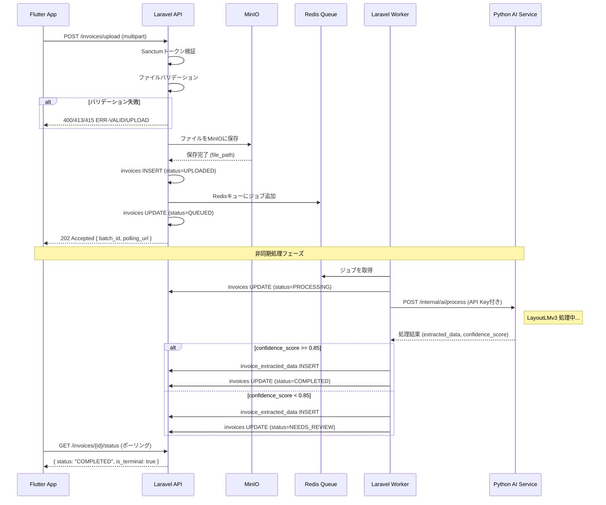

# Buổi 5 — Thiết kế API & Interface (インターフェース設計)

---

## Slide 1: Mục tiêu buổi học

### Sau buổi này bạn sẽ biết
- Nguyên tắc thiết kế RESTful API đúng chuẩn
- Thiết kế API bất đồng bộ (非同期 API): 202 Accepted + polling
- Viết API仕様書 với request/response đầy đủ
- Định nghĩa Error Code thống nhất
- Thiết kế phân trang, filter, sort cho 100,000+ records
- Bảo mật API: tại sao POST /ai/process KHÔNG được expose ra Flutter

### Ôn tập buổi 4
> **Quiz:** Data Source của bảng AI抽出結果 trong S020 là table nào + JOIN gì?
> Tại sao cần Signed URL thay vì public URL cho file hóa đơn?

---

## Slide 2: Tại sao API Design quan trọng?

### Hậu quả của API Design kém

| Vấn đề | Nguyên nhân | Chi phí sửa |
|--------|------------|------------|
| Flutter phải poll liên tục không biết dừng khi nào | Không định nghĩa trạng thái terminal | Cao |
| N+1 Query problem | API không có JOIN/include | Rất cao |
| Frontend không biết xử lý lỗi gì | Error code không định nghĩa | Trung bình |
| List API trả về 100,000 records | Thiếu pagination | Rất cao |
| AI service bị tấn công trực tiếp | Expose internal API | Nghiêm trọng |

### Nguyên tắc vàng cho AI-IA
> POST /ai/process là **INTERNAL API** — chỉ Laravel gọi Python AI Service.
> Flutter **KHÔNG BAO GIỜ** gọi trực tiếp AI Service.
> AI Service API key chỉ tồn tại trong Laravel .env — không bao giờ xuất ra Flutter.

---

## Slide 3: RESTful API — Quy tắc cơ bản

### HTTP Method & Resource Mapping

| Method | Path | Ý nghĩa | Ví dụ |
|--------|------|---------|-------|
| GET | /invoices | Lấy danh sách | Danh sách hóa đơn |
| GET | /invoices/{id} | Lấy 1 record | Chi tiết hóa đơn |
| POST | /invoices/upload | Tạo mới (async) | Upload hóa đơn → 202 |
| PUT | /invoices/{id} | Cập nhật toàn bộ | Sửa extracted data |
| PATCH | /invoices/{id}/status | Cập nhật 1 phần | Đổi status |
| DELETE | /invoices/{id} | Xóa | Xóa hóa đơn (soft) |

### URL Naming Rules

```
✅ Đúng:
POST /api/v1/invoices/upload              (upload async)
GET  /api/v1/invoices/{id}/status         (polling endpoint)
POST /api/v1/invoices/{id}/approve        (action verb cho business operation)
GET  /api/v1/journal-entries              (danh từ, số nhiều)
GET  /admin/users                         (admin prefix)

❌ Sai:
GET  /processInvoice                      (verb trong URL)
GET  /invoice-list                        (singular + verb)
POST /api/v1/ai/process  (exposed publicly → BẢO MẬT NGHIÊM TRỌNG)
```

---

## Slide 4: API一覧 — AI-IA System

### Authentication

| Method | Path | Mô tả | Auth |
|--------|------|-------|------|
| POST | /api/v1/auth/login | Đăng nhập (Sanctum) | ❌ |
| POST | /api/v1/auth/logout | Đăng xuất | ✅ |
| GET | /api/v1/auth/me | Lấy thông tin user hiện tại | ✅ |
| PUT | /api/v1/auth/password | Đổi mật khẩu | ✅ |

### Invoices (Accountant + Reviewer)

| Method | Path | Mô tả | Auth | Role |
|--------|------|-------|------|------|
| POST | /api/v1/invoices/upload | Upload hóa đơn (async, 202) | ✅ | All |
| GET | /api/v1/invoices | Danh sách hóa đơn | ✅ | All |
| GET | /api/v1/invoices/{id} | Chi tiết hóa đơn | ✅ | All |
| GET | /api/v1/invoices/{id}/status | Polling trạng thái AI | ✅ | All |
| POST | /api/v1/invoices/{id}/approve | Approve AI result | ✅ | accountant+ |
| POST | /api/v1/invoices/{id}/retry | Retry failed invoice | ✅ | accountant+ |
| DELETE | /api/v1/invoices/{id} | Soft delete | ✅ | accountant+ |

### Journal Entries

| Method | Path | Mô tả | Auth | Role |
|--------|------|-------|------|------|
| GET | /api/v1/journal-entries | Danh sách bút toán | ✅ | All |
| GET | /api/v1/journal-entries/{id} | Chi tiết bút toán | ✅ | All |
| PUT | /api/v1/journal-entries/{id} | Sửa bút toán | ✅ | accountant+ |

### Batch Processing

| Method | Path | Mô tả | Auth | Role |
|--------|------|-------|------|------|
| GET | /api/v1/batches/{id}/status | Polling batch status | ✅ | All |

### Internal Only (KHÔNG expose ra Flutter)

| Method | Path | Mô tả | Caller | Note |
|--------|------|-------|--------|------|
| POST | /api/v1/ai/process | Gửi hóa đơn tới Python AI | Laravel Worker | **INTERNAL** |

### Admin

| Method | Path | Mô tả | Auth | Role |
|--------|------|-------|------|------|
| GET/POST/PUT | /api/v1/admin/users | Quản lý user | ✅ | Admin |
| GET/POST/PUT | /api/v1/admin/suppliers | Quản lý nhà cung cấp | ✅ | Admin |
| GET/POST/PUT | /api/v1/admin/account-codes | Quản lý mapping | ✅ | Admin |
| GET | /api/v1/admin/reports | Báo cáo tổng hợp | ✅ | Admin |

---

## Slide 5: API仕様書 — POST /invoices/upload (Async 202)

> **Điểm quan trọng:** Upload file hóa đơn là bất đồng bộ. Return 202 Accepted ngay lập tức, không chờ AI xử lý xong.

```yaml
## POST /api/v1/invoices/upload — 請求書アップロード (非同期)

### リクエスト

Headers:
  Authorization: Bearer {sanctum_token}
  Content-Type: multipart/form-data

Body (multipart):
  | Field    | Type          | Required | Rule                              |
  |----------|---------------|----------|-----------------------------------|
  | files[]  | file (binary) | ✓        | PDF, JPEG, PNG, WEBP; max 10MB/件 |
  | files[]  | ...           | ...      | 最大50ファイル/リクエスト          |

バリデーション (Laravelサーバーサイド — Flutterは UX用のみ):
  - ファイル形式: MIMEタイプ + マジックバイト両方チェック
  - ファイルサイズ: 1ファイル最大 10MB
  - ファイル数: 最大 50件
  - 合計サイズ: 最大 200MB

### レスポンス 202 Accepted (非同期受付)

{
  "data": {
    "batch_id": "550e8400-e29b-41d4-a716-446655440000",
    "total_count": 3,
    "invoice_ids": [
      "uuid-inv-001",
      "uuid-inv-002",
      "uuid-inv-003"
    ],
    "status": "QUEUED",
    "polling_url": "/api/v1/batches/550e8400.../status",
    "message": "3件の請求書をキューに追加しました。GET polling_urlで進捗を確認できます。"
  }
}

### レスポンス 400 Bad Request (バリデーションエラー)
{
  "error": {
    "code": "ERR-VALID-001",
    "message": "入力値が不正です",
    "details": [
      { "field": "files[0]", "message": "PDFまたは画像ファイルのみアップロード可能です" },
      { "field": "files[1]", "message": "ファイルサイズが10MBを超えています" }
    ]
  }
}

### レスポンス 413 Payload Too Large
{
  "error": {
    "code": "ERR-UPLOAD-413",
    "message": "ファイルの合計サイズが200MBを超えています"
  }
}
```

---

## Slide 6: API仕様書 — GET /invoices/{id}/status (Polling)

> **ポーリングエンドポイント:** Flutter が定期的に呼び出して AI 処理状態を確認する。

```yaml
## GET /api/v1/invoices/{id}/status — AI処理状態ポーリング

### リクエスト

Headers:
  Authorization: Bearer {sanctum_token}

Path Parameters:
  id: UUID (請求書ID)

### レスポンス 200 OK

{
  "data": {
    "id": "uuid-inv-001",
    "status": "COMPLETED",
    "retry_count": 0,
    "is_terminal": true,        ← Flutter はこのフラグでポーリング停止を判断
    "extracted_data": {         ← COMPLETED/NEEDS_REVIEW 時のみ含む
      "supplier_name": "株式会社サンプル電機",
      "invoice_date": "2026-03-15",
      "total_amount": 110000.00,
      "tax_amount": 10000.00,
      "confidence_score": 0.9234
    },
    "error_message": null,      ← FAILED 時のみ値あり
    "updated_at": "2026-03-24T09:15:42+09:00"
  }
}

### ステータス別の is_terminal フラグ

| status         | is_terminal | Flutter の動作               |
|----------------|-------------|------------------------------|
| UPLOADED       | false       | ポーリング継続 (5秒間隔)       |
| QUEUED         | false       | ポーリング継続 (5秒間隔)       |
| PROCESSING     | false       | ポーリング継続 (3秒間隔)       |
| COMPLETED      | true        | ポーリング停止、レビュー画面へ  |
| NEEDS_REVIEW   | true        | ポーリング停止、レビュー画面へ  |
| FAILED         | true        | ポーリング停止、エラー表示      |

### レスポンス 404 Not Found
{ "error": { "code": "ERR-INV-001", "message": "請求書が見つかりません" } }

### レスポンス 403 Forbidden
{ "error": { "code": "ERR-AUTH-002", "message": "この請求書にアクセスする権限がありません" } }
```

---

## Slide 7: API仕様書 — POST /invoices/{id}/approve (承認)

```yaml
## POST /api/v1/invoices/{id}/approve — AI結果承認・仕訳登録

### リクエスト

Headers:
  Authorization: Bearer {sanctum_token}
  Content-Type: application/json

Path Parameters:
  id: UUID (請求書ID)

Body:
{
  "extracted_data": {               ← レビュー画面で修正した場合
    "supplier_name": "株式会社サンプル電機",
    "invoice_date": "2026-03-15",
    "total_amount": 110000.00,
    "tax_amount": 10000.00
  },
  "journal_entries": [              ← 確認・修正した仕訳
    {
      "debit_account_code": "5101",
      "debit_account_name": "仕入高",
      "credit_account_code": "2101",
      "credit_account_name": "買掛金",
      "amount": 100000.00,
      "description": "株式会社サンプル電機 3月分仕入"
    },
    {
      "debit_account_code": "5103",
      "debit_account_name": "仮払消費税",
      "credit_account_code": "2101",
      "credit_account_name": "買掛金",
      "amount": 10000.00,
      "description": "消費税"
    }
  ]
}

### レスポンス 200 OK

{
  "data": {
    "invoice_id": "uuid-inv-001",
    "status": "COMPLETED",
    "journal_entries": [
      {
        "id": "uuid-je-001",
        "debit_account_code": "5101",
        "credit_account_code": "2101",
        "amount": 100000.00,
        "approved_by": "uuid-user-001",
        "approved_at": "2026-03-24T09:20:00+09:00"
      }
    ],
    "message": "仕訳を承認・登録しました"
  }
}

### レスポンス 422 業務ルール違反
{
  "error": {
    "code": "ERR-INV-422",
    "message": "この請求書はすでに承認済みです",
    "details": { "current_status": "COMPLETED" }
  }
}
```

---

## Slide 8: API仕様書 — GET /journal-entries (Pagination + Filter)

```yaml
## GET /api/v1/journal-entries — 仕訳一覧 (ページネーション + フィルター)

### リクエスト

Headers:
  Authorization: Bearer {sanctum_token}

Query Parameters:
  | Name         | Type    | Required | Default      | Description                    |
  |--------------|---------|----------|--------------|--------------------------------|
  | page         | integer | No       | 1            | ページ番号 (1始まり)             |
  | per          | integer | No       | 20           | 1ページ件数 (max: 100)          |
  | approved     | boolean | No       | null         | true=承認済み, false=未承認     |
  | from         | date    | No       | null         | 作成日の開始 (YYYY-MM-DD)       |
  | to           | date    | No       | null         | 作成日の終了 (YYYY-MM-DD)       |
  | q            | string  | No       | null         | 摘要・仕入先名で検索            |
  | sort         | string  | No       | created_at   | created_at / amount / invoice_date |
  | order        | string  | No       | desc         | asc / desc                     |

### レスポンス 200 OK

{
  "data": [
    {
      "id": "uuid-je-001",
      "invoice": {
        "id": "uuid-inv-001",
        "original_filename": "invoice_march.pdf"
      },
      "debit_account_code": "5101",
      "debit_account_name": "仕入高",
      "credit_account_code": "2101",
      "credit_account_name": "買掛金",
      "amount": 100000.00,
      "description": "株式会社サンプル電機 3月分",
      "is_ai_suggested": true,
      "approved_by": {
        "id": "uuid-user-001",
        "name": "田中 花子"
      },
      "approved_at": "2026-03-24T09:20:00+09:00",
      "created_at": "2026-03-24T09:15:42+09:00"
    }
  ],
  "meta": {
    "total": 1250,
    "page": 1,
    "per": 20,
    "total_pages": 63
  }
}
```

---

## Slide 9: セキュリティ設計 — INTERNAL API の保護

### なぜ POST /ai/process を公開してはいけないか

```
❌ 危険な設計:
Flutter → POST /ai/process (直接AI Serviceへ)
問題:
  1. AI Service URL + API Keyが Flutter アプリに含まれる
  2. Flutter アプリはリバースエンジニアリング可能
  3. 攻撃者がAI Serviceを直接叩ける → コスト無限増加
  4. 財務データが不正なルートで処理される

✅ 正しい設計:
Flutter → POST /invoices/upload (Laravel)
          Laravel → Redis Queue
          Laravel Worker → POST /ai/process (Python AI Service)
                           ↑ この呼び出しはサーバー間のみ
理由:
  1. AI Service API Key は Laravel .env にのみ存在
  2. Python AI Service は社内ネットワークからのみアクセス可能
  3. Laravel がファイルのバリデーション・サニタイズを実施してからAIに渡す
  4. Flutter は一切 AI Service の存在を知らない
```

### Laravel → Python AI Service の内部通信仕様

```yaml
## POST /internal/ai/process — Laravel Worker → Python FastAPI (INTERNAL)

### 認証
X-Internal-API-Key: {AI_SERVICE_API_KEY}  ← Laravel .env にのみ保存

### リクエスト Body
{
  "invoice_id": "uuid-inv-001",
  "file_path": "invoices/2026/03/uuid-inv-001.pdf",
  "file_type": "PDF",
  "callback_url": "http://laravel-internal/api/internal/ai-callback"
}

### レスポンス 202 Accepted
{ "job_id": "ai-job-uuid-xxx" }

### コールバック (Python → Laravel, 処理完了後)
POST /api/internal/ai-callback
{
  "invoice_id": "uuid-inv-001",
  "status": "success",
  "extracted_data": { ... },
  "confidence_score": 0.9234,
  "ai_model_version": "layoutlmv3-base-sroie-v1.2"
}
```

---

## Slide 10: エラーコード設計

### エラーコード命名規則

**フォーマット:** `ERR-[MODULE]-[CODE]`

| モジュール | Prefix | 例 |
|----------|--------|-----|
| 認証・認可 | AUTH | ERR-AUTH-001 |
| バリデーション | VALID | ERR-VALID-001 |
| 請求書 | INV | ERR-INV-001 |
| 仕訳 | JNL | ERR-JNL-001 |
| AI処理 | AI | ERR-AI-001 |
| アップロード | UPLOAD | ERR-UPLOAD-001 |
| DB | DB | ERR-DB-001 |
| システム | SYS | ERR-SYS-001 |

### エラーコード一覧 (主要)

| コード | HTTPステータス | メッセージ (日本語) | 発生条件 |
|--------|-------------|------------------|---------|
| ERR-AUTH-001 | 401 | 認証が必要です | トークンなし/期限切れ |
| ERR-AUTH-002 | 403 | この操作は許可されていません | 権限不足 |
| ERR-AUTH-003 | 401 | メールまたはパスワードが正しくありません | ログイン失敗 |
| ERR-AUTH-004 | 423 | アカウントがロックされています | 5回失敗 |
| ERR-VALID-001 | 400 | 入力値が不正です | バリデーション失敗 |
| ERR-INV-001 | 404 | 請求書が見つかりません | 存在しないID |
| ERR-INV-422 | 422 | この請求書は処理できません | ステータス不正 |
| ERR-UPLOAD-413 | 413 | ファイルサイズが上限を超えています | >10MB |
| ERR-UPLOAD-415 | 415 | 対応していないファイル形式です | 不正MIME |
| ERR-AI-001 | 503 | AI処理サービスが利用できません | Python Service down |
| ERR-AI-002 | 422 | ファイルからデータを抽出できませんでした | AI処理失敗 |
| ERR-JNL-001 | 404 | 仕訳が見つかりません | 存在しないID |
| ERR-DB-001 | 500 | サーバーエラーが発生しました | DB接続失敗 |
| ERR-SYS-001 | 500 | 予期しないエラーが発生しました | Unhandled exception |

---

## Slide 11: Authentication Design — Laravel Sanctum

### Sanctum Bearer Token フロー

```
[Flutter]                        [Laravel API]
   │                                │
   │  POST /auth/login              │
   │  { email, password }           │
   │ ─────────────────────────────> │
   │                                │ 1. パスワード検証 (bcrypt)
   │                                │ 2. Sanctumトークン生成
   │                                │ 3. personal_access_tokens に保存
   │  200 OK                        │
   │  { token: "1|abc123..." }      │
   │ <───────────────────────────── │
   │                                │
   │  POST /invoices/upload         │
   │  Authorization: Bearer 1|abc..│
   │ ─────────────────────────────> │
   │                                │ 1. トークン検証
   │                                │ 2. ユーザー特定
   │                                │ 3. ロール確認
   │  202 Accepted { batch_id }     │
   │ <───────────────────────────── │
```

### なぜ Sanctum を選んだか (JWT との比較)

```
Laravel Sanctum (選択):
  ✅ Laravel エコシステムに完全統合
  ✅ トークンのDB保存 → 即時無効化可能 (ログアウト時)
  ✅ 財務システムに適したセッション管理
  ✅ 実装が単純で確実

JWT (不採用):
  ❌ トークンをDB保存しないため即時無効化不可
  ❌ 会計システムでのセキュリティリスクが高い
  ❌ Laravel での独自実装が必要
```

---

## Slide 12: Pagination & Filter の統一設計

### 全Listエンドポイントの共通仕様

```
Query Parameters (共通):
  page      : integer, default=1, min=1
  per       : integer, default=20, max=100
  sort      : string, テーブルごとに許可するカラムを定義
  order     : 'asc' | 'desc', default='desc'

Response Meta (共通):
  {
    "meta": {
      "total":       1250,  // 全件数
      "page":        1,     // 現在ページ
      "per":         20,    // 1ページ件数
      "total_pages": 63     // 総ページ数
    }
  }
```

### invoicesの許可sortカラム
```
created_at, updated_at, status, original_filename
```

### journal_entriesの許可sortカラム
```
created_at, amount, approved_at
```

---

## Slide 13: Thực hành tại lớp (25 phút)

### Bài tập — Viết API Spec cho POST /invoices/{id}/retry

**Thiết kế API:** `POST /api/v1/invoices/{id}/retry`

**Yêu cầu nghiệp vụ:**
- Kế toán viên retry một hóa đơn bị FAILED
- Điều kiện: status phải là FAILED và retry_count < 3
- Laravel đẩy lại vào Redis Queue
- Status thay đổi FAILED → QUEUED
- Audit log ghi nhận ai retry, khi nào

**Nhiệm vụ, viết đầy đủ:**
1. Request headers + path params
2. Response 200 (success) với body đầy đủ
3. Response cho các error cases:
   - 404 (hóa đơn không tồn tại)
   - 403 (không phải chủ sở hữu hóa đơn)
   - 422 (retry_count đã = 3, không thể retry thêm)
   - 422 (status không phải FAILED, không thể retry)

---

## Slide 13b: AI活用 — API仕様書 & Sequence Diagramを自動生成する

### ユースケース別ツール

| 目的 | ツール | 出力形式 |
|------|--------|---------|
| API仕様書ドラフト作成 | **Claude / ChatGPT** | Markdown / OpenAPI YAML |
| Sequence Diagram | **Claude + Mermaid** | Mermaid sequenceDiagram |
| OpenAPI → Swagger UI | **Swagger Editor** | インタラクティブUI |
| APIテスト | **Bruno / Postman** | コレクション |

---

### プロンプトテンプレート 1 — API仕様書ドラフト生成

```
以下の仕様でRESTful APIの仕様書をMarkdown形式で書いてください。

システム: AI請求書自動処理システム (AI-IA)
エンドポイント: POST /api/v1/invoices/upload (非同期アップロード)

要件:
- 認証: Laravel Sanctum Bearer Token必須
- リクエスト: multipart/form-data, files[] 配列
- バリデーション (Laravel側):
  - ファイル形式: PDF, JPEG, PNG, WEBP (MIMEタイプ+マジックバイト)
  - ファイルサイズ: 1ファイル最大10MB
  - ファイル数: 最大50件
- 処理:
  1. MinIOにファイルをアップロード
  2. invoicesテーブルにINSERT (status=UPLOADED)
  3. Redisキューにジョブ追加 (status→QUEUED)
  4. 202 Acceptedを即返す (AI処理を待たない)
- レスポンス: 202, 400, 413, 415, 401, 500

エラーコード形式: ERR-[MODULE]-[CODE]
レスポンスフォーマット:
  成功: { "data": {...} }
  失敗: { "error": { "code": "...", "message": "...", "details": [...] } }
```

---

### AIが生成する Sequence Diagram (アップロードフロー)



---

### プロンプトテンプレート 2 — OpenAPI YAML生成

```
以下のAPI一覧をOpenAPI 3.0 YAML形式で書いてください。
最初の3エンドポイントだけでOKです。

1. POST /api/v1/invoices/upload
   - multipart/form-data: files[] 配列
   - レスポンス: 202 (batch_id, polling_url), 400, 413, 415

2. GET /api/v1/invoices/{id}/status
   - パスパラメータ: id (UUID)
   - レスポンス: status, is_terminal, extracted_data(任意), error_message(任意)

3. POST /api/v1/invoices/{id}/approve
   - リクエストBody: extracted_data, journal_entries[]
   - レスポンス: 承認された仕訳一覧

共通:
- 全エンドポイントにBearer認証 (Laravel Sanctum)
- エラーレスポンスは ErrorResponse スキーマを再利用
```

> → 生成されたYAMLを **Swagger Editor** (editor.swagger.io) に貼り付けると
> インタラクティブなAPIドキュメントが即完成

---

### プロンプト精度を上げる3つのコツ

```
コツ 1: 「システムコンテキスト」を毎回冒頭に入れる
  ──────────────────────────────────────────────────
  あなたはAI請求書自動処理システム(AI-IA)のAPI設計者です。
  Flutter(Frontend) + Laravel(Backend) + Python FastAPI(AI Service)
  の3層構成で、AI処理は非同期(Redis Queue経由)です。
  認証はLaravel Sanctum Bearer Tokenです。
  ──────────────────────────────────────────────────

コツ 2: 非同期処理のパターンを明示する
  ──────────────────────────────────────────────────
  このAPIは非同期処理です。
  リクエスト受信後すぐに202 Acceptedを返し、
  処理完了はGET /status エンドポイントでポーリングする設計です。
  ──────────────────────────────────────────────────

コツ 3: セキュリティ要件を明示する
  ──────────────────────────────────────────────────
  財務システムのため:
  - ファイルはMinIO Signed URL (30分有効) で返す
  - AI ServiceのURLとAPI KeyはレスポンスBodyに含めない
  - 他のユーザーの請求書へのアクセスは403で拒否
  ──────────────────────────────────────────────────
```

---

## Slide 14: Tóm tắt buổi 5 & Bài tập về nhà

### Tóm tắt
- Upload API: 202 Accepted (async) + polling endpoint — không chờ AI xong
- `is_terminal: true/false` giúp Flutter biết khi nào dừng polling
- POST /ai/process là **INTERNAL ONLY** — AI API key không bao giờ ra Flutter
- Laravel Sanctum thay vì JWT: token DB-stored → có thể revoke ngay lập tức
- Pagination `page/per/total/total_pages` phải thống nhất toàn bộ API
- Error Code format: `ERR-MODULE-CODE`

### Bài tập về nhà
> Hoàn thiện API Spec cho các endpoint sau:
>
> 1. `GET /api/v1/admin/reports/ai-accuracy` — Báo cáo độ chính xác AI (date range, group by model version)
> 2. `GET /api/v1/batches/{id}/status` — Batch polling với breakdown status từng file
> 3. `PUT /api/v1/journal-entries/{id}` — Sửa bút toán trước khi approve (bao gồm trường hợp đã approve rồi)
>
> Mỗi API cần: URL, method, query/body params, response 200, response error cases

### Buổi sau
**Buổi 6:** Thiết kế Batch & Security — Xử lý tự động và bảo mật hệ thống tài chính
