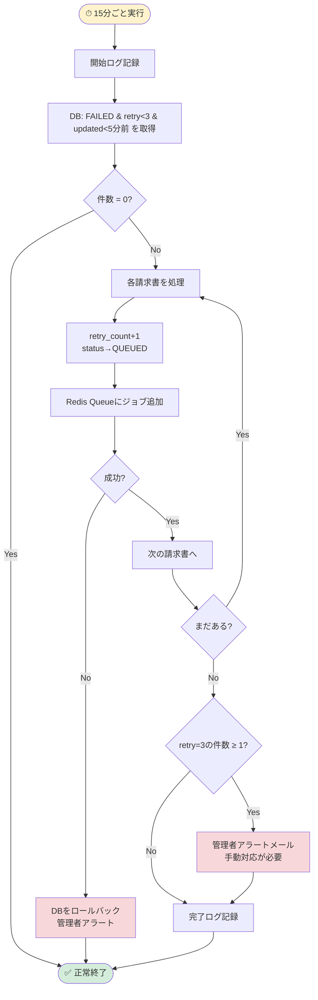

# Buổi 6 — Thiết kế Batch, Security & Infrastructure

---

## Slide 1: Mục tiêu buổi học

### Sau buổi này bạn sẽ biết
- Thiết kế Batch Job cho hệ thống AI processing đúng chuẩn
- Viết Security Design cho hệ thống tài chính (OWASP Top 10)
- Bảo vệ AI Service API key — không bao giờ expose ra Flutter
- Thiết kế Infrastructure với Docker multi-service
- Tổng hợp 非機能要件 vào thiết kế cụ thể

### Ôn tập buổi 5
> **Quiz:** Tại sao POST /ai/process là INTERNAL API? Điều gì xảy ra nếu Flutter gọi trực tiếp Python AI Service?

---

## Slide 2: Batch Design — Tổng quan

### AI-IA cần các Batch Job nào?

| Batch ID | Tên | Mục đích | Lịch chạy |
|---------|-----|---------|-----------|
| BATCH-001 | 待機中請求書の処理 | QUEUED状態が長時間の請求書を再キュー | Mỗi 5 phút |
| BATCH-002 | 失敗請求書の自動リトライ | FAILED & retry_count < 3 を自動再試行 | Mỗi 15 phút |
| BATCH-003 | 一時ファイルのクリーンアップ | MinIO上の処理済み一時ファイル削除 | Hàng ngày 02:00 |
| BATCH-004 | 日次処理サマリーレポート生成 | AI処理成功率・失敗率の集計 | Hàng ngày 06:00 |
| BATCH-005 | 完了請求書のアーカイブ | 1年以上前のCOMPLETED請求書をアーカイブ | Hàng tháng ngày 1 01:00 |

---

## Slide 3: Batch設計書 — BATCH-001 待機中請求書の再キュー

```
━━━━━━━━━━━━━━━━━━━━━━━━━━━━━━━━━━━━━━━━━━━━━━
バッチID:    BATCH-001
バッチ名:    待機中請求書の処理チェックバッチ
目的:        QUEUEDまたはPROCESSINGのまま長時間放置された請求書を
             検出し、処理を再開する (Workers がクラッシュした場合の対策)
━━━━━━━━━━━━━━━━━━━━━━━━━━━━━━━━━━━━━━━━━━━━━━

【実行スケジュール】
方式:    Laravel Scheduler (artisan schedule:run)
スケジュール: '*/5 * * * *' (5分ごと)
タイムゾーン: Asia/Tokyo

【処理フロー】
STEP 1: 長時間待機中の請求書を抽出
  SELECT id, status, updated_at
  FROM invoices
  WHERE status IN ('QUEUED', 'PROCESSING')
    AND updated_at < NOW() - INTERVAL '10 minutes'
    AND deleted_at IS NULL;

STEP 2: PROCESSING → QUEUEDにリセット (Workerがクラッシュした可能性)
  UPDATE invoices
  SET status = 'QUEUED', updated_at = NOW()
  WHERE id IN (PROCESSING対象一覧)
    AND status = 'PROCESSING';

STEP 3: QUEUEDのジョブをRedisキューに再追加
  各 invoice_id に対して:
    → Redis Queue に ProcessInvoiceJob を dispatch

STEP 4: 監査ログ記録
  INSERT INTO audit_logs (action='BATCH_REQUEUE', ...) ...

STEP 5: バッチ実行ログを記録

【冪等性確保】
  - 同じ請求書が2回キューに入っても、PROCESSING状態のチェックで2重処理を防ぐ
  - Worker は処理開始時に status = QUEUED → PROCESSING のCAS更新で排他制御

【エラーハンドリング】
  - Redis接続失敗: エラーログ記録、管理者メール通知
  - DB接続失敗: 実行ログにFAILURE記録
  - 部分失敗: ロールバックせず成功分をコミット

【ログ仕様】
  batch_execution_logs に記録:
  - batch_id, started_at, finished_at
  - processed_count, requeued_count, failure_count
```

---

## Slide 4: Batch設計書 — BATCH-002 失敗請求書の自動リトライ

```
━━━━━━━━━━━━━━━━━━━━━━━━━━━━━━━━━━━━━━━━━━━━━━
バッチID:    BATCH-002
バッチ名:    失敗請求書の自動リトライバッチ
目的:        FAILED状態でリトライ可能な請求書（retry_count < 3）を
             自動的に再処理キューに追加する
━━━━━━━━━━━━━━━━━━━━━━━━━━━━━━━━━━━━━━━━━━━━━━

【実行スケジュール】
'*/15 * * * *' (15分ごと)

【処理フロー】
STEP 1: リトライ可能な失敗請求書を抽出
  SELECT id, retry_count, error_message
  FROM invoices
  WHERE status = 'FAILED'
    AND retry_count < 3
    AND deleted_at IS NULL
    AND updated_at < NOW() - INTERVAL '5 minutes';
    -- 5分以上経過した失敗のみ (直後の再試行は避ける)

STEP 2: retry_count を増加してQUEUEDに変更
  UPDATE invoices
  SET status = 'QUEUED',
      retry_count = retry_count + 1,
      error_message = NULL,
      updated_at = NOW()
  WHERE id = {invoice_id}
    AND status = 'FAILED'  -- 楽観的チェック
    AND retry_count < 3;

STEP 3: Redisキューに再追加

STEP 4: retry_count = 3 でなお FAILED の場合
  → 管理者への通知メール送信
  → 手動対応が必要なフラグを立てる

【冪等性確保】
  - retry_count < 3 の条件で2重リトライを防ぐ
  - STEP 2のCAS更新 (AND status = 'FAILED') で排他

【エラーハンドリング】
  ・Python AI Service が連続失敗している場合:
    3件以上 FAILED が発生 → ERR-AI-001 を検出
    → 管理者に「AIサービス障害の可能性」アラート送信
    → 新規リトライを一時停止 (設定フラグで制御)
```

---

## Slide 5: Batch設計書 — BATCH-003 一時ファイルのクリーンアップ

```
━━━━━━━━━━━━━━━━━━━━━━━━━━━━━━━━━━━━━━━━━━━━━━
バッチID:    BATCH-003
バッチ名:    一時ファイルクリーンアップバッチ
目的:        MinIOおよびローカルの一時ファイルを削除し、
             ストレージ使用量を管理する
━━━━━━━━━━━━━━━━━━━━━━━━━━━━━━━━━━━━━━━━━━━━━━

【実行スケジュール】
'0 2 * * *' (毎日 02:00 JST)

【処理フロー】
STEP 1: 削除対象を確認
  - Python AI Service が生成した中間ファイル (処理済みのもの)
  - アップロード失敗で invoice レコードが作成されなかったファイル
  - deleted_at が設定された invoice の MinIO ファイル (30日経過後)

STEP 2: MinIO から削除
  MinIO SDK を使用してオブジェクト削除
  → 削除前に invoice テーブルで参照されていないことを確認

STEP 3: 統計レポート
  削除件数、解放容量(MB)をバッチログに記録

【重要な設計制約】
  → COMPLETED / NEEDS_REVIEW の invoice ファイルは絶対に削除しない
  → 削除前に invoices テーブルとの整合性チェック必須
  → 削除したファイルのパスを cleanup_logs テーブルに記録
```

---

## Slide 6: Batch設計書 — BATCH-004 日次処理サマリーレポート生成

```
━━━━━━━━━━━━━━━━━━━━━━━━━━━━━━━━━━━━━━━━━━━━━━
バッチID:    BATCH-004
バッチ名:    日次AI処理サマリーレポート生成バッチ
目的:        前日のAI処理結果を集計し、管理者向けレポートを生成する
━━━━━━━━━━━━━━━━━━━━━━━━━━━━━━━━━━━━━━━━━━━━━━

【実行スケジュール】
'0 6 * * *' (毎日 06:00 JST — 前日分を集計)

【処理フロー】
STEP 1: 前日の処理結果を集計
  SELECT
    COUNT(*) FILTER (WHERE status = 'COMPLETED') as completed,
    COUNT(*) FILTER (WHERE status = 'FAILED') as failed,
    COUNT(*) FILTER (WHERE status = 'NEEDS_REVIEW') as needs_review,
    AVG(ied.confidence_score) as avg_confidence,
    COUNT(*) as total_processed
  FROM invoices i
  LEFT JOIN invoice_extracted_data ied ON i.id = ied.invoice_id
  WHERE i.created_at::date = CURRENT_DATE - INTERVAL '1 day'
    AND i.status IN ('COMPLETED', 'FAILED', 'NEEDS_REVIEW');

STEP 2: ai_model_version 別の精度も集計
STEP 3: ai_daily_reports テーブルにINSERT
STEP 4: 管理者にサマリーメール送信 (成功率が80%以下なら警告メール)

【テーブル設計 (ai_daily_reports)]
  date DATE PK, total_processed INT, completed_count INT,
  failed_count INT, needs_review_count INT,
  avg_confidence NUMERIC(5,4), created_at TIMESTAMPTZ
```

---

## Slide 7: Batch設計書 — BATCH-005 完了請求書のアーカイブ

```
━━━━━━━━━━━━━━━━━━━━━━━━━━━━━━━━━━━━━━━━━━━━━━
バッチID:    BATCH-005
バッチ名:    完了請求書アーカイブバッチ
目的:        1年以上前のCOMPLETE済み請求書をアーカイブテーブルに移動し、
             メインテーブルのパフォーマンスを維持する (大量データ対策)
━━━━━━━━━━━━━━━━━━━━━━━━━━━━━━━━━━━━━━━━━━━━━━

【実行スケジュール】
'0 1 1 * *' (毎月1日 01:00 JST)

【処理フロー】
STEP 1: アーカイブ対象を確認 (ドライラン)
  SELECT COUNT(*) FROM invoices
  WHERE status = 'COMPLETED'
    AND created_at < NOW() - INTERVAL '1 year'
    AND deleted_at IS NULL;

STEP 2: invoices_archive テーブルにINSERT
STEP 3: 対応する invoice_extracted_data を extracted_data_archive へ
STEP 4: 元テーブルからSOFT DELETE (deleted_at = NOW())
  ※物理削除はしない。7年保持義務のため。

【重要な設計制約】
  → journal_entries は絶対にアーカイブ対象外 (会計帳簿として永久保存)
  → アーカイブ前に journal_entries.approved_at が設定済みであることを確認
  → アーカイブ完了を audit_logs に記録

【冪等性確保】
  - invoices_archive に同一 id が存在する場合はスキップ
  - 月次で同バッチが2回実行されても安全
```

---

## Slide 8: Security Design — 全体方針

### セキュリティ設計の構成

```
セキュリティ設計
│
├── 1. 認証・認可設計
│   ├── Laravel Sanctum Bearer Token
│   ├── 権限チェック (RBAC: accountant/reviewer/admin)
│   └── アカウントロック (5回失敗 → 30分ロック)
│
├── 2. AI Service API Key管理 (重要!)
│   ├── API Key は Laravel .env のみに保存
│   ├── Flutter に絶対に渡さない
│   └── Python AI Service は内部ネットワークのみアクセス可
│
├── 3. ファイルセキュリティ
│   ├── MinIO Signed URL (30分有効)
│   ├── ファイルアップロード制限 (OWASP)
│   └── AES-256 暗号化 at rest
│
├── 4. 通信セキュリティ
│   ├── HTTPS強制 (TLS 1.3)
│   └── Laravel ↔ Python: 内部ネットワーク + API Key
│
├── 5. 入力値検証
│   ├── SQLインジェクション対策
│   ├── XSS対策
│   └── ファイルアップロード制限 (OWASP Top 10)
│
├── 6. 監査ログ設計
│   └── 記録対象・形式・保存期間 (7年)
│
└── 7. レートリミット
    └── ログイン試行・アップロード・AI処理
```

---

## Slide 9: Security Design — AI API Key管理 (核心)

### AI Service API Key の管理方針

```
【絶対に守るルール】

✅ AI API Key の正しい管理:
  1. Laravel の .env ファイルにのみ保存
     AI_SERVICE_URL=http://ai-service:8000
     AI_SERVICE_API_KEY=xxxx-yyyy-zzzz

  2. Laravel Worker から Python AI Service を呼ぶ際に使用
     $response = Http::withHeaders([
       'X-Internal-API-Key' => config('services.ai.api_key')
     ])->post(config('services.ai.url') . '/process', [...]);

  3. .env は Git にコミットしない (.gitignore に追加)
  4. 本番の API Key は CI/CD 環境変数または Vault で管理

❌ 絶対に禁止:
  - Flutter アプリに AI Service URL を含める
  - API レスポンスに AI_SERVICE_URL を含める
  - フロントエンドの JavaScript/Dart コードに API Key をハードコード
  - ログに API Key を出力する
```

### Signed URL 生成の仕様

```
【MinIO Signed URL 設計】

生成タイミング: GET /invoices/{id} または GET /invoices/{id}/status
               のレスポンス時にLaravelが生成

有効期限: 30分 (1800秒)

実装:
  $signedUrl = $minioClient->getObjectUrl(
    bucket: 'invoices',
    key: $invoice->file_path,
    expiry: '+30 minutes'
  );

レスポンスに含める:
  { "data": { ..., "file_url": "https://minio/signed-url-xxx" } }

理由:
  - 30分以降は URL が無効 → ファイルが外部に漏れない
  - MinIO の public アクセスは完全に無効化
  - 財務書類の不正アクセスを防止
```

---

## Slide 10: Security Design — ファイルアップロード (OWASP対応)

### OWASP Top 10 対応 — ファイルアップロードの制限

```
【ファイルアップロードのバリデーション】

1. ファイル形式チェック (二重チェック):
   ✅ Content-Type ヘッダー確認 (クライアント送信値)
   ✅ マジックバイト確認 (ファイル先頭バイトを読んで実際の形式確認)
   → 許可: PDF (25 50 44 46), JPEG (FF D8 FF), PNG (89 50 4E 47), WEBP
   → 不一致の場合: ERR-UPLOAD-415

2. ファイルサイズ制限:
   → 1ファイル最大 10MB
   → バッチ合計最大 200MB
   → Nginx でも制限: client_max_body_size 200m;

3. ファイル名のサニタイズ:
   → オリジナルファイル名は original_filename に保存 (表示用のみ)
   → MinIO 保存時は UUID に変換: {uuid}.{ext}
   → パストラバーサル攻撃防止

4. ウイルス/マルウェアスキャン:
   → ClamAV でスキャン後に MinIO に保存
   → スキャン失敗またはウイルス検出: ERR-UPLOAD-422, ファイル即削除

5. ストレージの隔離:
   → アップロードファイルは MinIO に保存 (Webルートの外)
   → Nginx から直接アクセス不可
   → Laravel 経由の Signed URL のみアクセス可能
```

### バリデーションの責任分担

```
【重要な設計原則】

Flutter のバリデーション = UX のみ (ユーザー体験向上)
Laravel のバリデーション = セキュリティ (信頼できる唯一の検証)

例:
  Flutter: ファイルサイズが10MB以上なら「アップロードできません」と表示
  Laravel: 必ずサーバーサイドでもファイルサイズ・形式を検証

理由:
  → Flutter アプリはリバースエンジニアリングされる可能性がある
  → HTTP リクエストは Burp Suite などで改ざんできる
  → サーバーサイドバリデーションが唯一の防衛線
```

---

## Slide 11: Security Design — 認証・認可 詳細

### Laravel Sanctum 設計

```
Access Token:
  種別: Laravel Sanctum Personal Access Token
  有効期限: 24時間 (財務システムとして短め設定)
  保存場所: personal_access_tokens テーブル
  フロント保存: Flutter SecureStorage (httpOnly相当)
  ※ localStorageには保存しない

Token 無効化:
  ログアウト時: 該当トークンをDBから削除
  パスワード変更時: 全トークンを削除
  Admin による強制ログアウト: admin API でトークン削除
```

### RBAC (Role-Based Access Control) 実装方針

```
Laravelミドルウェアで全APIに認証チェックを適用:

1. AuthMiddleware (全API)
   → Sanctumトークンの検証
   → ユーザーの有効性確認 (is_active = true)

2. RoleMiddleware (ロール別)
   → accountant: 自分の請求書・仕訳のみ操作可能
   → reviewer: 全請求書の閲覧・仕訳承認可能
   → admin: 全機能 + マスタ管理 + レポート

3. リソース所有者チェック (accountant)
   → 自分の請求書のみ操作可能
   → invoices.user_id = $request->user()->id
```

### アカウントロック設計

```
ロック条件: ログイン失敗 5回連続
ロック解除: 30分後に自動解除 OR Admin手動解除
実装方法:
  users.login_failure_count SMALLINT
  users.locked_until TIMESTAMPTZ (ロック解除日時)

ログイン時のチェック順:
  1. users.locked_until > NOW() → ERR-AUTH-004
  2. パスワード検証 (bcrypt)
  3. 失敗: login_failure_count + 1
     5回目: locked_until = NOW() + INTERVAL '30 minutes'
  4. 成功: login_failure_count = 0
```

---

## Slide 12: Infrastructure Design

### システム構成図

```
[インターネット / 社内ネットワーク]
       │
       │ HTTPS (TLS 1.3)
       ▼
┌──────────────────────────────────────────────────────────┐
│                  オンプレサーバー / クラウド              │
│                                                          │
│  ┌─────────────┐    ┌──────────────────────────────────┐ │
│  │   Nginx     │    │      Docker Compose              │ │
│  │  (リバース   │    │                                  │ │
│  │  プロキシ)   │───>│ ┌────────────────────────────┐  │ │
│  │  Port 443   │    │ │  Laravel App Container      │  │ │
│  └─────────────┘    │ │  (PHP 8.3 + Laravel 11)     │  │ │
│                     │ │  Port 9000 (php-fpm)         │  │ │
│                     │ └────────────┬───────────────┘  │ │
│                     │              │                   │ │
│                     │ ┌────────────▼───────────────┐  │ │
│                     │ │  Python AI Service          │  │ │
│                     │ │  (Python 3.10 + FastAPI)    │  │ │
│                     │ │  Port 8000 (INTERNAL ONLY)  │  │ │
│                     │ │  LayoutLMv3-base-sroie      │  │ │
│                     │ └────────────────────────────┘  │ │
│                     │                                  │ │
│                     │ ┌──────────────────────────────┐ │ │
│                     │ │  Redis 7 Container           │ │ │
│                     │ │  (Queue + Cache)             │ │ │
│                     │ └──────────────────────────────┘ │ │
│                     └──────────────────────────────────┘ │
│                              │                           │
│  ┌───────────────────────────────────────────────────┐   │
│  │           PostgreSQL 15                           │   │
│  │           (Primary + Standby)                     │   │
│  └───────────────────────────────────────────────────┘   │
│                              │                           │
│  ┌───────────────────────────────────────────────────┐   │
│  │    MinIO (S3-compatible, on-premise)               │   │
│  │    Bucket: invoices (private, Signed URL only)     │   │
│  └───────────────────────────────────────────────────┘   │
└──────────────────────────────────────────────────────────┘
         │
         │ (バックアップ用専用回線)
         ▼
┌──────────────────┐
│  バックアップサーバー│
│  (別ラック/別電源) │
└──────────────────┘

【重要な設計ポイント】
Python AI Service (Port 8000) は Nginx に expose しない
→ Docker internal network からのみアクセス可能
→ Laravel Worker のみが呼び出せる
```

### Docker Compose サービス一覧

| Service | Image | Port | External? | 役割 |
|---------|-------|------|-----------|------|
| nginx | nginx:alpine | 443 | ✅ Public | リバースプロキシ |
| laravel | php:8.3-fpm | 9000 | ❌ Internal | アプリケーション + Worker |
| python-ai | python:3.10 | 8000 | ❌ Internal | AI処理マイクロサービス |
| redis | redis:7-alpine | 6379 | ❌ Internal | Queue + Cache |
| postgres | postgres:15 | 5432 | ❌ Internal | メインDB |
| minio | minio/minio | 9090 | ❌ Internal | ファイルストレージ |

### 環境構成

| 環境 | 用途 | スペック |
|-----|------|--------|
| 本番 (Production) | 実サービス | 8 Core / 32GB RAM / 1TB SSD (AI処理のため高スペック) |
| ステージング (Staging) | 本番前確認 | 4 Core / 16GB RAM / 500GB SSD |
| 開発 (Development) | 開発・テスト | Docker on 開発PC (GPU不要: CPU推論モード) |

---

## Slide 13: Non-Functional Requirements → 設計への落とし込み

### Yokenteigi の非機能要件 → Basic Design での具体化

| 非機能要件 | 設計での実現方法 |
|----------|--------------|
| AI処理 ≤5秒/件 | Python AI Service の非同期処理 + LayoutLMv3 最適化 + GPU対応設計 |
| バッチ50件 ≤10分 | Redis Queue + 並列Worker (3プロセス) + 処理時間監視 |
| 検索・フィルター高速化 | (status, created_at) 複合Index + (user_id, status) Index |
| AES-256暗号化 | PostgreSQL pgcrypto + MinIO SSE (Server-Side Encryption) |
| OWASP Top 10 | マジックバイトチェック + ClamAV + Signed URL + パラメータ化クエリ |
| AI API Key保護 | .env のみ + Docker secrets + 絶対にフロントへ渡さない |
| 稼働率 99.5% | PostgreSQL Primary-Standby + Blue-Green Deploy |
| 監査ログ 7年保持 | audit_logs テーブル + 年次アーカイブバッチ |
| バックアップ毎日 | pg_dump + cronジョブ + MinIO バックアップ |

---

## Slide 14: Thực hành tại lớp (25 phút)

### Bài tập — Viết Batch Design cho BATCH-004

**Yêu cầu:** Tạo báo cáo tổng hợp hàng ngày

**Thông tin cần tính toán:**
- Tổng số hóa đơn xử lý trong ngày hôm trước
- Số COMPLETED / NEEDS_REVIEW / FAILED
- Average confidence score
- Theo từng ai_model_version

**Nhiệm vụ:**
1. Xác định lịch chạy batch
2. Viết processing flow (các step với SQL)
3. Xác định bảng đầu vào và bảng lưu kết quả
4. Xác định error handling (gửi cảnh báo khi tỷ lệ thành công < 80%)

---

## Slide 14b: AI活用 — System Architecture図 & Batch Flowを自動生成する

### ツール別用途

| ツール | 得意な図 | 特徴 |
|--------|---------|------|
| **Eraser.io** | Architecture図, C4 Diagram | AIプロンプトから即生成 |
| **Claude + Mermaid** | Batch Flow, Deployment Flow | テキストで細かく制御可能 |
| **Claude + PlantUML** | Component Diagram, Deployment | 詳細なUML図 |
| **Napkin.ai** | Architecture, Infra | 文章から自動でインフォグラフィック生成 |

---

### Tool 1: Eraser.io — System Architecture図を生成

**プロンプトテンプレート:**
```
AI請求書自動処理システムのサーバー構成図を作成してください。

構成:
- Flutter アプリ (Web + Mobile) からのHTTPS接続
- Nginx リバースプロキシ (Port 443, Public)
- Laravel App (PHP 8.3, Internal only)
- Python FastAPI AI Service (Port 8000, INTERNAL ONLY - Nginxに公開しない)
- Redis 7 (Queue + Cache, Internal)
- PostgreSQL 15 (Primary + Standby, Internal)
- MinIO (S3互換, ファイルストレージ, Internal)
- バックアップサーバー (別ラック)

重要:
- Python AI Service は Laravel からのみ呼び出し可能
- MinIO は Signed URL (30分) 経由でのみアクセス
- 矢印でデータフローを示してください
- セキュリティゾーンを色分けしてください
```

---

### Tool 2: Claude + Mermaid — Batch処理フロー生成

**プロンプトテンプレート:**
```
以下のバッチ処理フローをMermaid flowchartで書いてください。

バッチ名: 失敗請求書の自動リトライ (15分ごと実行)

処理:
1. バッチ開始ログを記録
2. DBから「FAILED」かつ retry_count < 3 かつ
   updated_at < 5分前 の請求書を取得
3. 取得件数が0件なら終了
4. 各請求書に対して:
   - retry_count + 1 に更新
   - status を FAILED → QUEUED に変更
   - Redis Queue にジョブを追加
5. retry_count = 3 の請求書が存在する場合:
   → 管理者にアラートメール送信
6. バッチ完了ログを記録 (処理件数、再キュー件数)

エラー処理:
- Redis接続失敗 → DB更新をロールバック、管理者アラート
- AI Service 障害（失敗が3件以上同時発生） → リトライ一時停止フラグ
```

**AIが生成するMermaid:**



---

### AIを使った設計書作成のワークフロー全体像

```
                Yokenteigi (要件定義書)
                       │
                       │ AIプロンプトの材料として使う
                       ▼
┌──────────────────────────────────────────────────┐
│              AI生成フロー                          │
│                                                   │
│  要件テキスト ──> Claude ──> DBML    ──> dbdiagram.io │
│                         ──> Mermaid ──> VS Code      │
│                         ──> OpenAPI ──> Swagger      │
│                         ──> Eraser  ──> Architecture │
└──────────────────────────────────────────────────┘
                       │
                       │ AIドラフトを人間がレビュー・修正
                       ▼
              基本設計書に組み込む
```

---

## Slide 15: Tóm tắt buổi 6 & Bài tập về nhà

### Tóm tắt
- Batch Design cần: schedule, flow chi tiết, error handling, idempotency
- BATCH-002: retry logic với retry_count < 3, escalation khi retry_count = 3
- AI API Key: **ONLY in Laravel .env** — đây là điểm bảo mật quan trọng nhất
- File upload security: magic bytes check + ClamAV + Signed URL 30 phút
- Validation: **Laravel = security**, Flutter = UX only — không bao giờ ngược lại
- Docker: Python AI Service KHÔNG expose ra ngoài Nginx

### Bài tập về nhà
> Hoàn thiện:
> 1. **BATCH-003** 一時ファイルのクリーンアップ — Flow đầy đủ với logic kiểm tra an toàn trước khi xóa MinIO file
> 2. **Security Design**: Viết phần レートリミット (rate limiting)
>    - Upload endpoint: giới hạn thế nào? (tránh spam AI processing)
>    - Login endpoint: giới hạn thế nào?
>    - Lưu state ở đâu? (Redis với key format: `rate_limit:{ip}:{endpoint}`)
> 3. **Docker Compose**: Viết docker-compose.yml cho 6 services (nginx, laravel, python-ai, redis, postgres, minio)

### Buổi sau
**Buổi 7:** Case Study (Phần 1) — Tổng hợp toàn bộ thành Basic Design Document
