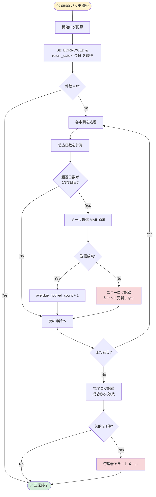

# Buổi 6 — Thiết kế Batch, Security & Infrastructure

---

## Slide 1: Mục tiêu buổi học

### Sau buổi này bạn sẽ biết
- Thiết kế Batch Job (xử lý định kỳ) đúng chuẩn
- Viết Security Design cho hệ thống nội bộ
- Thiết kế Infrastructure (server, network, deploy)
- Tổng hợp 非機能要件 vào thiết kế cụ thể

### Ôn tập buổi 5
> **Quiz:** JWT access token hết hạn sau 15 phút. Khi đó frontend làm gì? Flow refresh token hoạt động như thế nào?

---

## Slide 2: Batch Design — Tổng quan

### Hệ thống thiết bị cần các Batch Job nào?

| Batch ID | Tên | Mục đích | Lịch chạy |
|---------|-----|---------|-----------|
| BATCH-001 | 返却期限チェック | Cập nhật `is_overdue`, gửi thông báo | Hàng ngày 08:00 |
| BATCH-002 | 貸出開始日チェック | RESERVED → BORROWED khi đến ngày | Hàng ngày 07:00 |
| BATCH-003 | 古い通知削除 | Xóa notification > 1 năm | Hàng tuần CN 02:00 |
| BATCH-004 | 監査ログアーカイブ | Archive audit_log > 3 năm | Hàng tháng 01 ngày 01:00 |
| BATCH-005 | 利用率レポート生成 | Tạo báo cáo tháng | Ngày 1 hàng tháng 03:00 |

---

## Slide 3: Batch設計書 — BATCH-001 返却期限チェック

```
━━━━━━━━━━━━━━━━━━━━━━━━━━━━━━━━━━━━━━━━━━━━━━
バッチID:    BATCH-001
バッチ名:    返却期限チェック・通知送信バッチ
目的:        返却期限を超過した貸出申請を検出し、
             ユーザーと管理者に通知メールを送信する
━━━━━━━━━━━━━━━━━━━━━━━━━━━━━━━━━━━━━━━━━━━━━━

【実行スケジュール】
方式:    pg_cron (PostgreSQL拡張)
スケジュール: '0 8 * * *' (毎日 08:00 JST)
タイムゾーン: Asia/Tokyo

【処理フロー】
STEP 1: 超過対象を抽出
  SELECT id, user_id, equipment_id, return_date,
         actual_return_at, overdue_notified_count
  FROM applications
  WHERE status = 'BORROWED'
    AND return_date < CURRENT_DATE
    AND actual_return_at IS NULL;

STEP 2: 通知ルールに基づきメール送信
  超過日数 1日目  → MAIL-005を1回目送信
  超過日数 3日目  → MAIL-005を2回目送信
  超過日数 7日目  → MAIL-005を3回目送信（エスカレーション）
  超過日数 14日以上 → 管理者への定期アラート（毎日）

STEP 3: 送信済みをDBに記録
  UPDATE applications
  SET is_overdue = TRUE,
      overdue_notified_count = overdue_notified_count + 1
  WHERE id IN (送信済みのID一覧)

STEP 4: バッチ実行ログを記録
  INSERT INTO batch_execution_logs ...

【処理時間目標】
対象件数の上限想定: 50件/実行
目標処理時間: 5分以内

【エラーハンドリング】
・メール送信失敗: エラーログに記録、次回実行で再試行
  （overdue_notified_countは更新しない）
・DB接続失敗: 実行ログにFAILURE記録、管理者アラートメール送信
・部分失敗: ロールバックせず、成功分をコミット（べき等性確保）

【ログ仕様】
batch_execution_logs テーブルに記録:
  - batch_id, started_at, finished_at
  - processed_count, success_count, failure_count
  - error_detail (失敗時)
```

---

## Slide 4: Batch設計書 — BATCH-002 貸出開始日チェック

```
━━━━━━━━━━━━━━━━━━━━━━━━━━━━━━━━━━━━━━━━━━━━━━
バッチID:    BATCH-002
バッチ名:    貸出開始日チェック・ステータス更新バッチ
目的:        開始日を迎えた「予約済み」申請を「貸出中」に自動更新する
━━━━━━━━━━━━━━━━━━━━━━━━━━━━━━━━━━━━━━━━━━━━━━

【実行スケジュール】
'0 7 * * *' (毎日 07:00 JST)  ← BATCH-001より1時間前

【処理フロー】
STEP 1: 本日開始の予約済み申請を抽出
  SELECT a.id, a.equipment_id
  FROM applications a
  WHERE a.status = 'APPROVED'
    AND a.start_date = CURRENT_DATE;

STEP 2: トランザクション内で更新
  BEGIN;

  UPDATE applications
  SET status = 'BORROWED', updated_at = NOW()
  WHERE id = {app_id};

  UPDATE equipment
  SET status = 'BORROWED', version = version + 1, updated_at = NOW()
  WHERE id = {equipment_id}
    AND status = 'RESERVED';  -- 楽観ロック

  -- equipment の更新が0件 → ROLLBACK (手動で既に変更済みの可能性)

  INSERT INTO equipment_status_histories ...
  INSERT INTO application_status_histories ...
  INSERT INTO audit_logs ...

  COMMIT;

【冪等性（べき等性）確保】
バッチが2回実行されても同じ結果になること:
- status = 'APPROVED' AND start_date = CURRENT_DATE の条件が満たされなければ何もしない
```

---

## Slide 5: Security Design — 全体方針

### セキュリティ設計の構成

```
セキュリティ設計
│
├── 1. 認証・認可設計
│   ├── JWT + リフレッシュトークン
│   ├── 権限チェック (RBAC)
│   └── アカウントロック
│
├── 2. 通信セキュリティ
│   ├── HTTPS強制 (社内VPN内でも)
│   └── TLS 1.2以上
│
├── 3. データセキュリティ
│   ├── 暗号化対象
│   ├── パスワードハッシュ
│   └── 個人情報マスキング
│
├── 4. 入力値検証
│   ├── SQLインジェクション対策
│   ├── XSS対策
│   └── ファイルアップロード制限
│
├── 5. 監査ログ設計
│   └── 記録対象・形式・保存期間
│
└── 6. レートリミット
    └── ログイン試行・API呼び出し
```

---

## Slide 6: Security Design — 認証・認可 詳細

### JWT設計

```
Access Token:
  署名アルゴリズム: RS256 (非対称鍵)
  有効期限: 15分
  Payload: { sub, email, role, department_id, iat, exp }
  保存場所: クライアント側 httpOnly Cookie
  ※ localStorageは使わない (XSS脆弱性)

Refresh Token:
  形式: 暗号学的乱数 (128bit)
  有効期限: 7日
  保存場所: DB (Redis) + httpOnly Cookie
  無効化: ログアウト時・パスワード変更時に全失効
```

### RBAC (Role-Based Access Control) 実装方針

```
ミドルウェアで全APIに認証チェックを適用:

1. Authenticationミドルウェア (全API)
   → JWTの検証
   → ユーザーの有効性確認 (is_active = true)

2. Authorizationミドルウェア (Admin専用API)
   → role = 'admin' のチェック
   → 例: router.use('/admin/*', requireAdmin)

3. リソース所有者チェック (User専用)
   → 自分の申請のみ操作可能
   → applications.user_id = req.user.id
```

### アカウントロック設計

```
ロック条件: ログイン失敗 5回連続
ロック解除: 30分後に自動解除 OR Admin手動解除
実装方法:
  users.login_failure_count INTEGER
  users.locked_until TIMESTAMPTZ (ロック解除日時)

ログイン時のチェック順:
  1. users.locked_until > NOW() → ERR-AUTH-004
  2. パスワード検証
  3. 失敗: login_failure_count + 1
     5回目: locked_until = NOW() + INTERVAL '30 minutes'
  4. 成功: login_failure_count = 0
```

---

## Slide 7: Security Design — 入力値検証 & XSS対策

### SQLインジェクション対策

```
全DBアクセスにParameterized Query (プリペアードステートメント)を使用。
ORMを使う場合でもRAWクエリは禁止。

✅ 正しい実装:
  const result = await db.query(
    'SELECT * FROM equipment WHERE id = $1',
    [equipmentId]
  );

❌ 禁止:
  const result = await db.query(
    `SELECT * FROM equipment WHERE id = '${equipmentId}'`
  );
```

### XSS対策

```
1. 出力エスケープ:
   全てのHTMLへの出力はエスケープライブラリを使用
   Vue.js の場合: v-html は使わず、テキストバインディング

2. Content Security Policy (CSP) ヘッダー:
   Content-Security-Policy: default-src 'self';
     script-src 'self'; style-src 'self' 'unsafe-inline';
     img-src 'self' data: https://internal.company.co.jp;

3. httpOnly Cookie:
   document.cookie でアクセス不可能なCookieに認証情報保存
```

### ファイルアップロード制限

```
許可形式: JPEG, PNG, WebP のみ
  → MIMEタイプチェック (Content-Typeだけでなくマジックバイトも確認)
最大サイズ: 5MB
ウイルスチェック: ClamAV でスキャン後に保存
ファイル名: UUIDに変換 (オリジナル名は保存しない)
保存先: Webルートの外 (/data/equipment-images/)
```

---

## Slide 8: Infrastructure Design

### システム構成図

```
[社内ネットワーク / VPN]
       │
       │ HTTPS (TLS 1.3)
       ▼
┌──────────────────────────────────────────────────┐
│                  オンプレサーバー                  │
│                                                  │
│  ┌─────────────┐    ┌─────────────────────────┐  │
│  │   Nginx     │    │      Docker Host         │  │
│  │  (リバース   │    │                         │  │
│  │  プロキシ)   │───>│ ┌───────────────────┐   │  │
│  │  Port 443   │    │ │  App Container     │   │  │
│  └─────────────┘    │ │  (Node.js:3000)    │   │  │
│                     │ └───────────────────┘   │  │
│                     │          │              │  │
│                     │ ┌───────────────────┐   │  │
│                     │ │  Redis Container   │   │  │
│                     │ │  (Session/Cache)   │   │  │
│                     │ └───────────────────┘   │  │
│                     └─────────────────────────┘  │
│                              │                   │
│  ┌─────────────────────────────────────────────┐ │
│  │           PostgreSQL 15 Server              │ │
│  │           (Primary + Standby)               │ │
│  └─────────────────────────────────────────────┘ │
│                                                  │
│  ┌─────────────────────────────────────────────┐ │
│  │    共有ストレージ (/data/equipment-images)    │ │
│  └─────────────────────────────────────────────┘ │
└──────────────────────────────────────────────────┘
         │
         │ (バックアップ用専用回線)
         ▼
┌──────────────────┐
│  バックアップサーバー │
│  (別ラック/別電源) │
└──────────────────┘
```

### 環境構成

| 環境 | 用途 | サーバースペック |
|-----|------|--------------|
| 本番 (Production) | 実サービス | 4 Core / 16GB RAM / 500GB SSD |
| ステージング (Staging) | 本番前確認 | 2 Core / 8GB RAM / 200GB SSD |
| 開発 (Development) | 開発・テスト | Docker on 開発PC |

---

## Slide 9: Deployment Design — CI/CD

### デプロイフロー

```
Developer
    │
    │ git push origin feature/xxx
    ▼
GitHub / GitLab
    │
    │ Trigger CI Pipeline
    ▼
CI Server (GitHub Actions / GitLab CI)
    │
    ├── 1. Lint & Type Check
    ├── 2. Unit Tests
    ├── 3. Integration Tests (テストDB使用)
    ├── 4. Build Docker Image
    └── 5. Push to Registry
              │
              │ (mainブランチマージ時のみ)
              ▼
       ステージング自動デプロイ
              │
              │ 手動承認 (PM / TL)
              ▼
       本番デプロイ (Blue-Green)
```

### Blue-Green Deployment

```
現在: Blue環境が稼働中 (v1.0)

デプロイ:
1. Green環境 (v1.1) を起動
2. ヘルスチェック確認
3. Nginxのトラフィックを Blue → Green に切り替え (ダウンタイムゼロ)
4. Blue環境はしばらく待機 (ロールバック用)

ロールバック:
1. Nginxのトラフィックを Green → Blue に戻す
2. 所要時間: 約1分
```

---

## Slide 10: 監視設計 (Monitoring)

### 監視項目

| カテゴリ | 監視項目 | 閾値 | アラート先 |
|---------|---------|------|---------|
| インフラ | CPU使用率 | >80% (5分間) | Adminメール |
| インフラ | メモリ使用率 | >85% | Adminメール |
| インフラ | ディスク使用率 | >90% | Adminメール |
| アプリ | APIレスポンスタイム | p95 > 5秒 | Adminメール |
| アプリ | エラー率 | >5% (5分間) | Adminメール |
| DB | コネクション数 | >80%使用率 | Adminメール |
| バッチ | バッチ未実行 | 予定時刻+30分 | Adminメール |
| 外形監視 | HTTP死活確認 | 応答なし (5分) | Adminメール |

### ログ設計

```
ログレベル:
  ERROR  : エラー・例外 (必ず記録)
  WARN   : 警告・異常値
  INFO   : 重要操作の完了 (申請作成, 承認など)
  DEBUG  : 開発環境のみ

ログフォーマット (JSON):
{
  "timestamp": "2026-03-24T08:00:00.000Z",
  "level": "INFO",
  "request_id": "uuid-xxxx",
  "user_id": "uuid-yyyy",
  "action": "APPLICATION_CREATED",
  "message": "申請番号 APP-202603-00042 を作成しました",
  "duration_ms": 145
}

ローテーション: 1日1ファイル
保存期間: 90日 (本番) / 7日 (ステージング)
```

---

## Slide 11: Non-Functional Requirements → 設計への落とし込み

### Yokenteigi の非機能要件 → Basic Design での具体化

| 非機能要件 | 設計での実現方法 |
|----------|--------------|
| レスポンス 3秒以内 | PostgreSQL Index設計 + Redis Cache + Nginx gzip圧縮 |
| 稼働率 99.5% | PostgreSQL Primary-Standby + Blue-Green Deploy |
| RTO 4時間 | 手動フェイルオーバー手順書 + バックアップからの復旧手順 |
| RPO 1時間 | 増分バックアップ 1時間毎 |
| HTTPS必須 | NginxでHTTPS強制, HTTP→301リダイレクト |
| VPN必須 | Nginxのallow/deny でネットワーク制限 |
| 監査ログ 3年保持 | `audit_logs`テーブル + 月次アーカイブバッチ |
| ログイン5回失敗ロック | `login_failure_count` + `locked_until` カラム |
| バックアップ毎日0時 | pg_dump + cronジョブ → バックアップサーバーへ転送 |

---

## Slide 12: Thực hành tại lớp (25 phút)

### Bài tập — Viết Batch Design cho BATCH-005

**Yêu cầu:** Tạo báo cáo tỷ lệ sử dụng hàng tháng

**Thông tin cần tính toán:**
- Mỗi category: số lần mượn, tổng ngày mượn, tỷ lệ sử dụng (%)
- Mỗi thiết bị: số lần mượn, người mượn nhiều nhất
- Số đơn quá hạn, tỷ lệ trả đúng hạn

**Nhiệm vụ:**
1. Xác định lịch chạy batch
2. Viết processing flow (các step)
3. Xác định bảng đầu vào và cách lưu kết quả
4. Xác định error handling

---

## Slide 12b: AI活用 — System Architecture図 & Batch Flowを自動生成する

### ツール別用途

| ツール | 得意な図 | 特徴 |
|--------|---------|------|
| **Eraser.io** | Architecture図, C4 Diagram | AIプロンプトから即生成、AWS/GCPアイコン対応 |
| **Claude + Mermaid** | Batch Flow, Deployment Flow | テキストで細かく制御可能 |
| **Claude + PlantUML** | Component Diagram, Deployment | 詳細なUML図 |
| **Napkin.ai** | Architecture, Infra | 文章から自動でインフォグラフィック生成 |

---

### Tool 1: Eraser.io — System Architecture図を生成

**手順:**
```
1. eraser.io を開く → New File → Diagram
2. 左上の「AI」ボタンをクリック
3. プロンプトを入力 → Generate
4. 生成された図を編集 → Export PNG
```

**プロンプトテンプレート:**
```
社内機器管理・貸出システムのサーバー構成図を作成してください。

構成:
- 社内ネットワーク(VPN)からのみアクセス可能
- Nginxリバースプロキシ (HTTPS Port 443)
- Dockerコンテナ: Node.js App (Port 3000)
- Dockerコンテナ: Redis (Session/Cache)
- PostgreSQL 15 (Primary + Standby)
- 共有ストレージ: /data/equipment-images
- バックアップサーバー (別ラック)
- 監視: サーバーリソース + アプリ死活

on-premiseサーバー構成でAWSは使わない。
矢印でデータフローを示してください。
```

---

### Tool 2: Claude + Mermaid — Batch処理フロー生成

**プロンプトテンプレート:**
```
以下のバッチ処理フローをMermaid flowchartで書いてください。

バッチ名: 返却期限超過チェック (毎日08:00実行)

処理:
1. バッチ開始ログを記録
2. DBから「BORROWED」かつ return_date < 本日の申請を取得
3. 取得件数が0件なら終了
4. 各申請に対して超過日数を計算
5. 超過日数が 1, 3, 7 日目 → メール送信対象
6. メール送信成功 → overdue_notified_count + 1
7. メール送信失敗 → エラーログ記録、カウントは更新しない
8. 全件処理後、バッチ完了ログを記録(成功数/失敗数)
9. 失敗が1件以上あれば管理者にアラートメール送信

エラー処理:
- DB接続失敗 → 即時終了、管理者アラート
```

**AIが生成するMermaid:**



---

### Tool 3: Claude + PlantUML — Deployment図生成

**プロンプトテンプレート:**
```
以下のデプロイフローをPlantUML activityDiagram形式で書いてください。

Blue-Green Deployment フロー:
1. 開発者がmainブランチにマージ
2. GitHub Actionsが起動
3. Lint → Unit Test → Integration Test → Build Docker Image
4. テスト失敗時: Slackに通知して停止
5. テスト全て成功: Docker Registryにpush
6. Green環境を起動
7. ヘルスチェック確認
8. Nginxのトラフィックを Blue → Green に切り替え
9. Blue環境を10分間スタンバイ (ロールバック用)
10. 問題なければ Blue環境を停止
```

---

### AIを使った設計書作成のワークフロー全体像

```
                Yokenteigi (要件定義書)
                       │
                       │ AIプロンプトの材料として使う
                       ▼
┌──────────────────────────────────────────────┐
│              AI生成フロー                     │
│                                              │
│  要件テキスト ──> Claude ──> DBML    ──> dbdiagram.io  │
│                         ──> Mermaid ──> VS Code / Eraser │
│                         ──> OpenAPI ──> Swagger Editor   │
│                         ──> ASCII Wireframe → v0.dev    │
│                         ──> PlantUML ──> plantuml.com   │
└──────────────────────────────────────────────┘
                       │
                       │ AIドラフトを人間がレビュー・修正
                       ▼
              基本設計書に組み込む
```

---

### プロンプト品質チェックリスト

```
送る前に確認:
☑ システム名・背景を冒頭に記載したか
☑ 出力フォーマットを指定したか (DBML/Mermaid/OpenAPI/etc.)
☑ 使用するツール名を明記したか (dbdiagram.io, draw.io, etc.)
☑ 関連テーブル・フローの具体的な情報を含めたか
☑ エラーケース・例外も含めるよう指示したか

生成後に確認:
☑ ビジネスロジックが要件と合っているか
☑ カーディナリティ・矢印の向きが正しいか
☑ 機密情報がプロンプトに含まれていないか
☑ 生成物をそのまま使わず、必ず人間がレビューしたか
```

---

## Slide 13: Tóm tắt buổi 6 & Bài tập về nhà

### Tóm tắt
- Batch Design cần: schedule, flow chi tiết, error handling, idempotency
- Security Design = Authentication + Authorization + Input Validation + Audit Log
- JWT: httpOnly Cookie + RS256 + 15min access token + 7day refresh token
- Infrastructure: Blue-Green deploy để zero downtime
- 非機能要件 phải được "cụ thể hóa" thành design decision

### Bài tập về nhà
> Hoàn thiện:
> 1. **BATCH-003** 古い通知削除 — Flow + error handling đầy đủ
> 2. **Security Design**: Viết phần レートリミット (rate limiting)
>    - Login endpoint: giới hạn thế nào?
>    - API endpoint thông thường: giới hạn thế nào?
>    - Lưu state ở đâu? (Redis?)
> 3. **DB Backup設計**: Viết cụ thể cron schedule + lệnh backup + kiểm tra backup định kỳ

### Buổi sau
**Buổi 7:** Case Study (Phần 1) — Tổng hợp toàn bộ thành Basic Design Document
